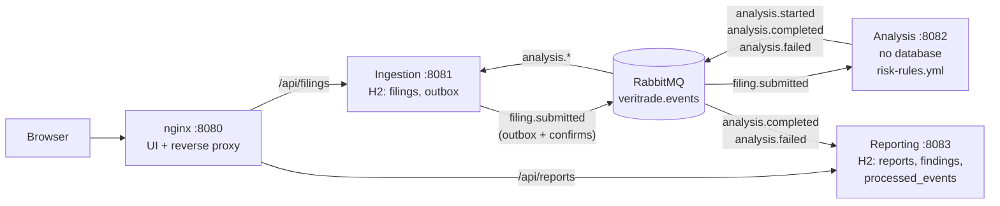

# VeriTrade Risk Analysis

VeriTrade Risk Analysis is a prototype that screens financial filings (for example 10-K excerpts)
for risk. A user submits a filing in the browser, and three Java microservices process it
asynchronously over RabbitMQ: **Ingestion** stores it, **Analysis** matches it against a set of
YAML rules, and **Reporting** stores the result as a report with findings by category and severity.
The focus is the design of the distributed system: messaging, idempotency, failure handling and
recovery. The analysis itself is deliberately simple.



More detail, including sequence diagrams for the happy path, the failure paths and duplicate
delivery, is in [docs/architecture.md](docs/architecture.md).

**Stack:** Java 21, Spring Boot 4.1, Spring AMQP 4.1, Jackson 3, Flyway, H2 (file mode),
RabbitMQ 4.3, nginx, plain HTML and JavaScript (ES modules), JUnit 5, Mockito, AssertJ, ArchUnit,
Testcontainers, `node:test`.

## Contents

- [Quick start](#quick-start)
- [How to run the tests](#how-to-run-the-tests)
- [Repository layout](#repository-layout)
- [Decisions and trade-offs](#decisions-and-trade-offs)
- [Resilience](#resilience)
- [Overall risk level](#overall-risk-level)
- [What I would do for production](#what-i-would-do-for-production)
- [AI tools](#ai-tools)
- [Known limitations](#known-limitations)

## Quick start

<!-- verify after infra merge -->
Prerequisites: Docker with Compose v2 (Docker Desktop, or colima on macOS). Java and Node are not
needed to run the system, because the images build the services themselves.

```bash
cp .env.example .env          # optional: change the RabbitMQ credentials and ports
docker compose up --build
```

<!-- verify after infra merge -->
| What | Address |
|---|---|
| Web UI | http://localhost:8080 |
| RabbitMQ management | http://localhost:15672 (user and password from `.env`; default `veritrade` / `veritrade`) |

Only these two ports are published. Ingestion, Analysis and Reporting are reachable only inside the
Compose network, through nginx.

In the UI, choose **Load sample** and then submit. The status moves from `SUBMITTED` through
`ANALYZING` to `COMPLETED`, and the report appears with the findings and highlighted excerpts. A
longer sample filing is in [`samples/sample-10k-excerpt.txt`](samples/sample-10k-excerpt.txt) and can
be uploaded as a `.txt` file.

<!-- verify after infra merge -->
The same through the API:

```bash
curl -i -X POST http://localhost:8080/api/filings \
  -H 'Content-Type: application/json' \
  -d '{"companyName":"Acme Holdings Inc.","title":"Form 10-K 2025","content":"We are subject to pending litigation. Management identified a material weakness in internal control."}'
# 202 Accepted, Location: /api/filings/{filingId}, body {"filingId":"...","status":"SUBMITTED"}

curl http://localhost:8080/api/filings/{filingId}    # status: SUBMITTED, ANALYZING, COMPLETED or FAILED
curl http://localhost:8080/api/reports/{filingId}    # 404 until the report is stored, then 200
curl 'http://localhost:8080/api/filings?limit=10'    # recent filings, newest first
```

The REST API is specified in [`docs/contracts/rest-api.openapi.yaml`](docs/contracts/rest-api.openapi.yaml).
All errors are RFC 9457 `ProblemDetail` responses (`application/problem+json`).

### Frontend without the backend

The UI can run against a dependency-free mock of the REST contract (Node 22 or newer):

```bash
node frontend/mock/server.js     # http://127.0.0.1:8090/
```

Put `[fail]` in the title to see a `FAILED` filing. See [`frontend/README.md`](frontend/README.md).

## How to run the tests

### Java services (unit and integration tests)

Requires Java 21 and a running Docker daemon (Testcontainers starts RabbitMQ).

```bash
./mvnw -B verify
```

- Unit tests (`*Test`) run with Surefire. Integration tests (`*IT`) run with Failsafe against a real
  RabbitMQ in Testcontainers (`rabbitmq:4.3-management-alpine`), on dynamic ports.
- Every service also has an ArchUnit test for its layering, and `common-contracts` validates every
  example in `docs/contracts/examples/` against the JSON Schemas.
- Current count: 650 tests (contracts 29; Ingestion 259 unit and 16 IT; Analysis 183 unit and
  12 IT; Reporting 134 unit and 17 IT).

**colima on macOS:** Testcontainers' Ryuk container cannot mount the colima socket path. Point
Testcontainers at the standard socket:

```bash
TESTCONTAINERS_DOCKER_SOCKET_OVERRIDE=/var/run/docker.sock ./mvnw -B verify
```

Linux and Docker Desktop do not need this.

What the integration tests cover, among other things:

- the outbox: an event reaches the broker and matches the schema; a nack or an unroutable return
  keeps the row unpublished; an unsent row is published after a restart;
- the full Analysis flow, a forced failure with exactly 3 attempts followed by `analysis.failed`,
  and poison messages that reach the `.dlq` without retries;
- duplicate delivery producing one report, late and contradictory events being acknowledged and not
  dead-lettered, and a transient failure being retried 3 times before the `.dlq`;
- the topology as seen through the RabbitMQ management API, and the refusal of a redeclaration with
  different arguments.

### Frontend

Requires Node 22 or newer and no `npm install`:

```bash
node --test frontend/test/
```

This runs 170 unit tests and an end-to-end test that starts the mock server on a random port and
drives the full HTTP flow, including the `FAILED`, 400, 404, 413, 500, timeout, network-error and XSS
paths.

### Smoke and chaos tests (running system)

<!-- verify after infra merge -->
With the system running (`docker compose up --build -d`):

```bash
scripts/smoke.sh    # submits scripts/demo-filing.json, waits for COMPLETED, checks the report,
                    # and submits a ~2 MB filing through nginx; exits non-zero on failure
scripts/chaos.sh    # stops Analysis, submits a filing, starts Analysis again and checks
                    # that the filing is still processed
```

Both scripts use only bash and curl.

<!-- verify after infra merge -->
The CI workflow (`.github/workflows/ci.yml`) runs two jobs on every push: `./mvnw -B verify`, then
`docker compose up --build -d`, `scripts/smoke.sh` and `docker compose down`.

### End-to-end test suite

> **Placeholder (Wave 2).** A dedicated end-to-end suite is added in Wave 2. It covers Analysis
> down, Reporting down, duplicate delivery, a poison message and an Ingestion restart before the
> outbox is flushed. This subsection will describe how to run it.

## Repository layout

| Path | Content |
|---|---|
| [`common-contracts/`](common-contracts/) | shared event records, enums, topology names, `EventIds`, `CorrelationIds` |
| [`ingestion-service/`](ingestion-service/) | REST intake, filing status, outbox publisher |
| [`analysis-service/`](analysis-service/) | rule engine and `risk-rules.yml` |
| [`reporting-service/`](reporting-service/) | reports, idempotency, REST read API |
| [`frontend/`](frontend/) | plain HTML/JS UI, mock server, `node:test` tests |
| [`infra/`](infra/) | Dockerfiles and nginx configuration |
| `scripts/` | smoke and chaos tests, AI conversation export |
| [`samples/`](samples/) | sample filing |
| [`docs/contracts/`](docs/contracts/) | JSON Schemas, examples, OpenAPI, messaging topology |
| [`docs/decisions/`](docs/decisions/) | architecture decision records |
| [`docs/PLAN.md`](docs/PLAN.md) | the development plan |

## Decisions and trade-offs

| Decision | Why | Cost | ADR |
|---|---|---|---|
| Asynchronous messaging over RabbitMQ; REST only from the browser | Analysis is slow, and a stopped service must not stop intake or lose filings | Eventual consistency; the UI polls; tests need a real broker | [0001](docs/decisions/0001-asynchronous-messaging-with-rabbitmq.md) |
| A database per service (file-mode H2) | Services are not coupled through a schema; the system starts with one command | No cross-service queries; H2 is not for production | [0002](docs/decisions/0002-database-per-service-h2.md) |
| Shared `common-contracts` module | One compile-checked definition of events, enums and topology names; the module contains contract types only | Services share one build and are released together | [0003](docs/decisions/0003-shared-contracts-module.md) |
| Transactional outbox with publisher confirms (Ingestion) | Storing a filing and announcing it become atomic; a row counts as sent only after the broker confirms it | At-least-once (repeats are possible); a single publisher instance | [0004](docs/decisions/0004-outbox-with-publisher-confirms.md) |
| One queue per consuming service | Keeps the order of a filing's events per consumer and keeps the topology small | One slow event type can delay another in the same queue | [0005](docs/decisions/0005-one-queue-per-consuming-service.md) |
| Rules in YAML, validated at startup | Easy to read, review and extend; a broken file stops the service at startup | Regex matching, not semantic analysis; a change needs a redeploy | [0006](docs/decisions/0006-risk-rules-in-yaml.md) |
| Choreography, not orchestration | A short linear flow; no extra service to run; services know only events | The flow is implicit; no central timeout or compensation | [0007](docs/decisions/0007-choreography-over-orchestration.md) |
| The first terminal event wins | Late or contradictory events are acknowledged and ignored, never dead-lettered | A stored result is never overwritten | [0008](docs/decisions/0008-first-terminal-event-wins.md) |
| Deterministic event ids (name-based UUID of filing id and event type) | A recomputed or redelivered event keeps its id, so Analysis needs no database to be idempotent | A deliberate re-analysis would need a new id scheme | [0009](docs/decisions/0009-deterministic-event-ids.md) |
| Plain HTML/JS behind nginx | No build, no Node in production, no CORS: nginx serves the UI and proxies both APIs | No framework or type checking | [0010](docs/decisions/0010-plain-html-js-behind-nginx.md) |

**Why choreography.** The flow has three steps and no compensation: when analysis fails, the filing
is simply marked `FAILED`. An orchestrator would be one more service to deploy and keep available,
and it would know every other service. With choreography each service reacts to events and owns its
own state. The cost is that the flow is not visible in one place, so it is documented in
[docs/architecture.md](docs/architecture.md) and followed through the `correlationId` in the logs.
A longer flow with compensating steps would justify an orchestrated saga.

**Where the shared module stops.** `common-contracts` holds only what crosses a service boundary:
the envelope, the payload records, the enums, the queue and routing-key names, `EventIds` and
`CorrelationIds`. REST DTOs, JPA entities, validation and business logic stay in each service. The
language-neutral reference is [`docs/contracts/`](docs/contracts/), and a test in the module keeps the
records and the JSON Schemas in step.

## Resilience

### When a service is down

| Down | What happens | After recovery |
|---|---|---|
| **Analysis** | Intake works. `filing.submitted` waits in the durable `analysis.filing-submitted` queue. Filings stay `SUBMITTED`; the UI stops polling after its limit (30 polls, 2 s apart) with a timeout message | Analysis consumes the backlog, and the filings complete |
| **Reporting** | Analysis results wait in `reporting.analysis-results`. The status still reaches `COMPLETED`, but `/api/reports/{id}` returns 404 (or 502 from nginx), so the UI times out on the report | Reporting stores the reports; reopening the filing in the UI shows the report |
| **Ingestion** | No new filings can be submitted, and the status cannot be read. Analysis events wait in `ingestion.analysis-events`. Reporting keeps serving reports | Unpublished outbox rows are sent on the first run, and the waiting events update the status |
| **RabbitMQ** | Ingestion still accepts filings: the outbox rows stay unpublished and the publisher tries again every 500 ms. Listeners reconnect automatically | The outbox drains in order; durable queues and persistent messages survive a broker restart (data volume) |

No queue has a TTL or a length limit, so a message waits as long as its consumer is down.

### Idempotency

Delivery is at-least-once. Repeats come from a lost acknowledgement, a listener retry or an outbox
row that is sent again after a lost confirm.

- **Event ids are deterministic** (`EventIds.forFiling(filingId, eventType)`), so a repeated or
  recomputed event keeps its id. The id is also the AMQP `messageId`.
- **Analysis** keeps no state. Analysing a filing again produces the same events with the same ids.
- **Ingestion** uses the status state machine: an event that asks for the current status is a
  duplicate, logged at INFO and acknowledged.
- **Reporting** writes the `eventId` to `processed_events` in the same transaction as the report, so
  both are committed or neither is. There is one report per `filingId`.

### Late and conflicting events

`COMPLETED` and `FAILED` are final; the first terminal event wins. A late or contradictory event
(`analysis.started` after `analysis.completed`, or `analysis.failed` after `analysis.completed`) is
acknowledged and ignored. A WARN line records the event id, the filing id and both states. Nothing is
thrown, because an exception would retry and then dead-letter a valid message. Ingestion also accepts
`SUBMITTED -> COMPLETED | FAILED` directly, in case `analysis.started` is late or lost.

### Retries

All three consumers use the Spring AMQP listener retry configured in `application.yml`:
**3 attempts**, then a recoverer. Backoff starts at 1 s, with multiplier 2 and at most 5 s.

```yaml
spring.rabbitmq.listener.simple.retry:
  enabled: true
  max-retries: 2        # Spring Boot 4.1 counts retries after the first attempt: 2 retries = 3 attempts
  initial-interval: 1s
  multiplier: 2
  max-interval: 5s
```

Spring Boot 4.1 has no `max-attempts` property any more. The old key is ignored without a warning,
and the default `max-retries: 3` would give 4 attempts. Integration tests assert exactly 3 attempts.

A message that cannot be read or validated is never retried: each service excludes its
invalid-message exception (and, in Reporting, `MessageConversionException`) from the retry policy, so
the message goes to the dead-letter queue at once.

### The two failure paths in Analysis

1. **Unreadable or invalid `filing.submitted`** (invalid JSON, a missing field, a wrong `eventType`):
   it goes straight to `analysis.filing-submitted.dlq`, with no retries. No `analysis.failed` is
   published, because the filing id cannot be trusted. The filing stays `SUBMITTED`.
2. **Processing failure** (an analyzer error, or a publish without a confirm): retried 3 times. Then
   `FailedAnalysisRecoverer` publishes `analysis.failed` with the reason and acknowledges the
   original message. Ingestion marks the filing `FAILED` with the reason, and Reporting stores a
   `FAILED` report. If even `analysis.failed` cannot be published, the message is dead-lettered so
   it is not lost.

### Dead-letter queues

| Work queue | Dead-letter queue | Gets |
|---|---|---|
| `analysis.filing-submitted` | `analysis.filing-submitted.dlq` | invalid `filing.submitted`; a failure where even `analysis.failed` could not be published |
| `ingestion.analysis-events` | `ingestion.analysis-events.dlq` | invalid events, unknown `eventType`, events for an unknown filing, failures after 3 attempts |
| `reporting.analysis-results` | `reporting.analysis-results.dlq` | invalid events, unknown enum values, `eventVersion` above 1, failures after 3 attempts |

Dead letters go through the direct exchange `veritrade.dlx`, with the work queue name as the routing
key. Nothing consumes the dead-letter queues; they are inspected (and can be moved back) in the
RabbitMQ management UI.

### Limitations of this design

- A poison `filing.submitted` leaves the filing `SUBMITTED` for good. Nothing detects stuck filings
  yet (see production improvements: a stale-filing sweeper).
- A dead-lettered event needs manual handling in the management UI; there is no replay tool.
- Only one Ingestion instance may run the outbox publisher.
- See [Known limitations](#known-limitations) for the full list.

## Overall risk level

Analysis computes the overall risk level in `RiskScorer` like this:

1. **No findings: `NONE`.**
2. Otherwise, start from the **highest severity** among the findings (`LOW`, `MEDIUM`, `HIGH` or
   `CRITICAL`).
3. If the number of findings is **at least the escalation threshold** (default **10**,
   `veritrade.analysis.rules.escalation-threshold`), raise the level **by one**:
   `LOW -> MEDIUM`, `MEDIUM -> HIGH`, `HIGH -> CRITICAL`. `CRITICAL` stays `CRITICAL`.

Examples: 3 findings with the highest severity `MEDIUM` give `MEDIUM`; 10 findings with the highest
severity `MEDIUM` give `HIGH`; 9 findings with the highest severity `HIGH` give `HIGH`.

Each rule contributes at most 50 findings (`max-matches-per-rule`). Overlapping matches of one rule
count once. The rules are in
[`analysis-service/src/main/resources/risk-rules.yml`](analysis-service/src/main/resources/risk-rules.yml):
33 rules covering the categories `FINANCIAL`, `LEGAL`, `OPERATIONAL`, `CYBERSECURITY`, `REGULATORY`
and `MARKET`.

## What I would do for production

- **PostgreSQL** instead of H2, one database or schema per service, with backups.
- **A clustered broker** (RabbitMQ quorum queues), or Kafka if event replay and retention matter.
- **Authentication and authorization** (OIDC at the gateway, service credentials for the broker),
  TLS everywhere, secrets in a vault.
- **A saga with compensation** if the flow grows (for example re-analysis, or notifications that can
  fail).
- **A stale-filing sweeper** that flags filings stuck in `SUBMITTED` or `ANALYZING`, and a
  dead-letter replay tool.
- **Tracing** with OpenTelemetry (the `correlationId` already crosses the services), and **metrics**
  (Micrometer and Prometheus: queue depth, outbox lag, analysis time, DLQ size) with alerts.
- **Scaling Analysis** with competing consumers on its queue. It is stateless, so this needs no code
  change. Scaling Ingestion would need outbox row locking (`FOR UPDATE SKIP LOCKED`) or a leader.
- **A claim check for large filings:** the text goes to object storage, and the event carries a
  reference instead of up to 2 MB of text.
- An outbox cleanup job, and a cleanup of old `processed_events` rows.
- Contract tests in CI between producers and consumers, and schema-registry style versioning.

## AI tools

The project was built with **Claude Code** (CLI, model Claude Opus 5.5).

| Part | How AI was used |
|---|---|
| Plan and contract (Wave 0) | Claude Code as the orchestrator: the repository skeleton, `common-contracts`, `docs/contracts/`, the Flyway migrations and the agent rules, following [`docs/PLAN.md`](docs/PLAN.md) |
| Services (Wave 1) | One subagent per area, run in parallel, each in its own git worktree and branch: Ingestion, Analysis, Reporting, Frontend and Infrastructure |
| Integration and documentation (Wave 2) | Subagents for integration and resilience checks, and for this documentation |
| Review (Wave 3, planned) | A separate read-only review pass, then fixes |

The orchestrator froze the contract first, gave each agent one folder, and merged their branches.
The agents reported problems back instead of working around the contract. Examples are the removed
`max-attempts` retry property in Spring Boot 4.1, the H2 2.4.240 CHECK-constraint bug, and code points
versus UTF-16 units in the length limits. The orchestrator then fixed the contract or the build for
everyone. Each agent left a handoff note in [`docs/handoff/`](docs/handoff/).

- Readable account of the process: [`docs/ai-process-log.md`](docs/ai-process-log.md)
- Raw, unedited conversation records: [`docs/ai-conversations/`](docs/ai-conversations/)

## Known limitations

Collected from the handoff notes of all agents.

**Data and build**
- **H2 2.4.240 CHECK-constraint bug.** In H2 2.4.240 (the version Spring Boot manages) a CHECK
  constraint such as `ck_filings_status` fails every insert with "Check constraint invalid" once the
  connection that created it has been closed. In practice that happens after Hikari retires the
  connection Flyway used, and every `POST /api/filings` then returns 500. H2 is **pinned to 2.3.232**
  in the parent `pom.xml`.
- **Length limits count UTF-16 code units**, the unit of the database columns. A character outside the
  Basic Multilingual Plane, such as an emoji, counts as two, so a company name of 101 emoji is
  rejected although it is only 101 characters. The contract says so. Reporting validates incoming
  events in code points and then shortens text to the column size without splitting a surrogate pair.
- The filing text (up to 2 MB) travels inside `filing.submitted` and is stored in the outbox row.

**Messaging**
- **Single outbox publisher instance.** Only one Ingestion instance may run the publisher
  (`ingestion.outbox.enabled=false` turns it off on the others).
- **A poison `filing.submitted` leaves the filing `SUBMITTED`.** The message is dead-lettered, and no
  `analysis.failed` is published because the filing id cannot be trusted.
- **An unknown enum value is dead-lettered.** For example, an `analysis.completed` with a new
  `RiskCategory` cannot be read by the contract records. Adding an enum value is therefore a breaking
  change that needs a new `eventVersion`.
- Reporting dead-letters an event with `eventVersion` above 1, so it can be replayed after an upgrade.
- On every listener retry Analysis publishes `analysis.started` again with the same `eventId`;
  consumers drop the repeat.
- Until Analysis has declared its queue, `filing.submitted` is unroutable. It is returned and stays in
  the outbox until the queue exists, so nothing is lost, but the first filings can wait.
- A deliberate re-analysis of a filing is not possible: the deterministic event ids would make the new
  events look like duplicates.
- Published outbox rows and `processed_events` rows are never deleted.

**API and UI**
- Reporting returns 404 (not 400) for a malformed filing id, because the OpenAPI defines only 200 and
  404 for that operation. Ingestion returns 400 for a malformed id.
- `generatedAt` in a report is the time Reporting stored it, not the analysis time.
- An empty `?limit=` on `GET /api/filings` means the default (20).
- The UI gives up after 30 status polls and 15 report polls (2 s apart) and shows a timeout message.
- The excerpt does not say where it starts in the filing, so the UI finds the highlight with a
  heuristic (based on the 120-character context). If none fits, the excerpt is shown without a
  highlight.
- `frontend/js/app.js` (DOM wiring only) has no automated test; it was checked by hand.

**Analysis**
- Matching is regex over the whole text in memory: about 1 s for 2 MB. Much larger filings would need
  the claim-check approach.

**Environment**
- On macOS with colima, the integration tests need
  `TESTCONTAINERS_DOCKER_SOCKET_OVERRIDE=/var/run/docker.sock`.
- RabbitMQ 4.3 refuses transient non-exclusive queues, so the test capture queues are durable and
  deleted after each test. The management API shows a server-added `x-queue-type: classic` argument
  that the services do not declare.
