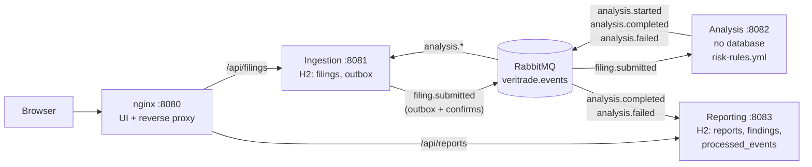

# VeriTrade Risk Analysis

VeriTrade Risk Analysis is a prototype that screens financial filings (for example 10-K excerpts)
for risk. A user submits a filing in the browser, and three Java microservices process it
asynchronously over RabbitMQ: **Ingestion** stores it, **Analysis** matches it against a set of
YAML rules, and **Reporting** stores the result as a report with findings by category and severity.
The focus is the design of the distributed system: messaging, idempotency, failure handling and
recovery. The analysis itself is deliberately simple.



More detail, including sequence diagrams for the happy path, the failure paths and duplicate
delivery, is in [docs/architecture.md](docs/architecture.md).

**Stack:** Java 21, Spring Boot 4.1, Spring AMQP 4.1, Jackson 3, Flyway, H2 (file mode),
RabbitMQ 4.3, nginx, plain HTML and JavaScript (ES modules), JUnit 5, Mockito, AssertJ, ArchUnit,
Testcontainers, `node:test`.

## Contents

- [Quick start](#quick-start)
- [How to run the tests](#how-to-run-the-tests)
- [Repository layout](#repository-layout)
- [Decisions and trade-offs](#decisions-and-trade-offs)
- [Resilience](#resilience)
- [Overall risk level](#overall-risk-level)
- [What I would do for production](#what-i-would-do-for-production)
- [AI tools](#ai-tools)
- [Known limitations](#known-limitations)

## Quick start

Prerequisites: Docker with Compose v2 (Docker Desktop, or colima on macOS). Java and Node are not
needed to run the system, because the images build the services themselves.

```bash
cp .env.example .env          # optional: RabbitMQ credentials, bind address and host ports
docker compose up --build -d --wait
```

`--wait` returns once all five containers (RabbitMQ, the three services and nginx) report healthy.
Every container has a health check, and the services start in order through
`depends_on: condition: service_healthy`: the Java services wait for RabbitMQ, and nginx waits for
Ingestion and Reporting.

| What | Address |
|---|---|
| Web UI | http://127.0.0.1:8080 (`UI_PORT`) |
| RabbitMQ management | http://127.0.0.1:15672 (`RABBITMQ_MANAGEMENT_PORT`); user and password are `RABBITMQ_USERNAME` / `RABBITMQ_PASSWORD`, `veritrade` / `veritrade` when no `.env` exists |

Only these two ports are published, and only on the loopback address `127.0.0.1`, so they are not
reachable from other machines. Ingestion (8081), Analysis (8082), Reporting (8083) and AMQP (5672)
are reachable only inside the Compose network `backend`; the browser reaches the two APIs through
nginx.

### Configuration

All settings are optional and go into `.env` (see [`.env.example`](.env.example)); the scripts read
the same file.

| Variable | Default | Meaning |
|---|---|---|
| `RABBITMQ_USERNAME`, `RABBITMQ_PASSWORD` | `veritrade` / `veritrade` | broker user of the services and the management UI |
| `BIND_ADDRESS` | `127.0.0.1` | host address the UI and the management UI are published on |
| `UI_PORT` | `8080` | host port of the UI |
| `RABBITMQ_MANAGEMENT_PORT` | `15672` | host port of the RabbitMQ management UI |

**The default broker password is for local use only.** The RabbitMQ image is built from
[`infra/docker/rabbitmq.Dockerfile`](infra/docker/rabbitmq.Dockerfile), which runs
[`infra/rabbitmq/credentials-guard.sh`](infra/rabbitmq/credentials-guard.sh) before the official
entrypoint. A known weak password (`veritrade`, the `.env.example` placeholder `change-me`, `guest`
or an empty one) is accepted only when `BIND_ADDRESS` is a loopback address (`127.*`, `::1` or
`localhost`); the broker then logs a `WARNING` line (`docker compose logs rabbitmq`). With any other
`BIND_ADDRESS`, for example `0.0.0.0`, the same password stops the container with an `ERROR` line, so
`docker compose up --wait` fails. To publish beyond loopback, set a strong `RABBITMQ_PASSWORD`. The
list of weak passwords is fixed; any other password counts as strong. A non-loopback UI has no
authentication, so that is an explicit choice of the operator.

The RabbitMQ password takes effect only when the `rabbitmq-data` volume is created, so after changing
it run `docker compose down -v`.

To stop the stack and remove its volumes (H2 files and broker data): `docker compose down -v`.

In the UI, choose **Load sample** and then submit. The status moves from `SUBMITTED` through
`ANALYZING` to `COMPLETED`, and the report appears with the findings and highlighted excerpts. A
longer sample filing is in [`samples/sample-10k-excerpt.txt`](samples/sample-10k-excerpt.txt) and can
be uploaded as a `.txt` file.

The same through the API (nginx forwards `X-Correlation-Id` to the service and back):

```bash
curl -i -X POST http://127.0.0.1:8080/api/filings \
  -H 'Content-Type: application/json' \
  -d '{"companyName":"Acme Holdings Inc.","title":"Form 10-K 2025","content":"We are subject to pending litigation. Management identified a material weakness in internal control."}'
# 202 Accepted, Location: /api/filings/{filingId}, body {"filingId":"...","status":"SUBMITTED"}

curl http://127.0.0.1:8080/api/filings/{filingId}    # status: SUBMITTED, ANALYZING, COMPLETED or FAILED
curl http://127.0.0.1:8080/api/reports/{filingId}    # 404 until the report is stored, then 200
curl 'http://127.0.0.1:8080/api/filings?limit=10'    # recent filings, newest first
```

The REST API is specified in [`docs/contracts/rest-api.openapi.yaml`](docs/contracts/rest-api.openapi.yaml).
All errors are RFC 9457 `ProblemDetail` responses (`application/problem+json`).

A client `X-Correlation-Id` is kept only when it is a strict ASCII token: 1 to 128 characters from
`[A-Za-z0-9._:-]`, after surrounding whitespace is stripped. Any other value (empty, too long,
non-ASCII, control characters, inner spaces, other punctuation) is replaced with a generated UUID, and
so is a missing header. The request is never rejected for its correlation id
([ADR 0012](docs/decisions/0012-replace-invalid-correlation-ids.md)).

### Frontend without the backend

The UI can run against a dependency-free mock of the REST contract (Node 22 or newer):

```bash
node frontend/mock/server.js     # http://127.0.0.1:8090/
```

Put `[fail]` in the title to see a `FAILED` filing. See [`frontend/README.md`](frontend/README.md).

## How to run the tests

To check the running system by hand, step by step (the UI, the API, a `FAILED` filing, the
dead-letter queues, a stopped service), follow [`docs/MANUAL-TESTING.md`](docs/MANUAL-TESTING.md).

### Java services (unit and integration tests)

Requires Java 21 and a running Docker daemon (Testcontainers starts RabbitMQ).

```bash
./mvnw -B verify
```

- Unit tests (`*Test`) run with Surefire. Integration tests (`*IT`) run with Failsafe against a real
  RabbitMQ in Testcontainers (`rabbitmq:4.3-management-alpine`), on dynamic ports.
- Every service also has an ArchUnit test for its layering, and `common-contracts` validates every
  example in `docs/contracts/examples/` against the JSON Schemas.
- Current count: 842 tests, all green, including the regression tests for the bugs the end-to-end
  suite and the Wave 3 review found:

  | Module | Unit tests (Surefire) | Integration tests (Failsafe) |
  |---|---|---|
  | `common-contracts` | 29 | - |
  | `ingestion-service` | 327 | 26 |
  | `analysis-service` | 286 | 20 |
  | `reporting-service` | 137 | 17 |

**colima on macOS:** Testcontainers' Ryuk container cannot mount the colima socket path. Point
Testcontainers at the standard socket:

```bash
TESTCONTAINERS_DOCKER_SOCKET_OVERRIDE=/var/run/docker.sock ./mvnw -B verify
```

Linux and Docker Desktop do not need this.

What the integration tests cover, among other things:

- the outbox: an event reaches the broker and matches the schema; a nack or an unroutable return
  keeps the row unpublished and counts no attempt; an unsent row is published after a restart; a row
  the AMQP client refuses is parked after its attempts while the next filing is still published; a
  broker outage (`rabbitmqctl stop_app`) parks nothing, and both filings arrive in order afterwards;
- the full Analysis flow, a forced failure with exactly 3 attempts followed by `analysis.failed`,
  and poison messages that reach the `.dlq` without retries; when `analysis.failed` itself is refused
  by the broker, the filing goes to the `.dlq` and the next filing is still analysed; the pause
  between the attempts grows as configured (exponential backoff);
- a newer `eventVersion` going to the `.dlq` without retries in Analysis and Ingestion, and an
  `analysis.failed` reason over 1000 UTF-16 units: Analysis cuts it without splitting a surrogate
  pair, Ingestion dead-letters a longer one;
- duplicate delivery producing one report, late and contradictory events being acknowledged and not
  dead-lettered, and a transient failure being retried 3 times before the `.dlq`;
- Ingestion reading analysis events that carry a `__TypeId__` header, as Analysis sends them (see
  [the `__TypeId__` lesson](#the-__typeid__-header));
- the topology as seen through the RabbitMQ management API, and the refusal of a redeclaration with
  different arguments.

### Frontend

Requires Node 22 or newer and no `npm install`:

```bash
node --test frontend/test/
```

This runs 218 tests: unit tests of the pure modules (API client, polling, flow session,
validation, rendering, highlighting), and an end-to-end test that starts the mock server on a random
port and drives the full HTTP flow, including the `FAILED`, 400, 404, 413, 500, retried 503, timeout,
network-error and XSS paths, and two overlapping flows where a late answer for the first filing must
not reach the screen. [`csp.test.js`](frontend/test/csp.test.js) checks statically that the UI needs
no inline script, style, event handler, `eval` or string timer, so it runs under the
Content-Security-Policy that nginx sends.

### Smoke and chaos tests (running system)

Both scripts need only bash (3.2 or newer, so the macOS default works), curl and `docker compose`.
They talk to the system through nginx and the RabbitMQ management API, and use `docker compose` only
to check the published ports and the credentials guard (smoke) or to stop and start services
(chaos). They read `.env` for the bind address, the ports and the credentials, reach the stack on
`BIND_ADDRESS` (`localhost` for a wildcard address), print a warning when the broker password is a
known weak one, print every failed check and exit non-zero on failure. Shared helpers are in
[`scripts/lib/common.sh`](scripts/lib/common.sh).

```bash
docker compose up --build -d --wait
scripts/smoke.sh
scripts/chaos.sh    # all six scenarios; or a subset, for example: scripts/chaos.sh d f
```

[`scripts/smoke.sh`](scripts/smoke.sh) checks:

- the UI: `/` is `text/html`, `/js/app.js` has a JavaScript MIME type, `/styles.css` is `text/css`,
  and `/mock/`, `/mock/server.js`, `/test/`, `/package.json` and `/README.md` are 404;
- security headers: the exact Content-Security-Policy and `X-Content-Type-Options: nosniff` on `/`,
  `/js/app.js`, `/styles.css`, an API response and nginx's own 404 problem, and no inline script,
  style or event handler in `index.html`;
- exposure: `docker compose port` shows both published ports on `BIND_ADDRESS`; the credentials guard
  alone (`docker compose run --rm --no-deps rabbitmq check`) refuses a weak password on `0.0.0.0`,
  warns on loopback and accepts a strong password on `0.0.0.0` silently; with a weak password, the
  running broker has logged the warning;
- errors: an invalid and a malformed submit give 400, an unknown filing id and an unknown report id
  give 404, all as `application/problem+json`;
- the demo filing [`scripts/demo-filing.json`](scripts/demo-filing.json) (built from the sample
  10-K excerpt): 202 with a `Location` header, `X-Correlation-Id` returned unchanged, status
  `COMPLETED` **and** a report with findings, both within 10 s of the submit (each timing is
  printed);
- the filing list contains the demo filing;
- the size limit through nginx: content of exactly 2,097,152 bytes gives 202, and one byte more gives
  400 problem+json from Ingestion, not 413 from nginx.

When the status is stuck, the script also looks for the filing's events in
`ingestion.analysis-events.dlq` and says so.

[`scripts/chaos.sh`](scripts/chaos.sh) runs six scenarios. Each prints PASS or FAIL with its
duration and brings the stack back up afterwards.

| | Scenario | What it checks |
|---|---|---|
| (a) | Analysis stopped | Submit while Analysis is stopped. The filing stays `SUBMITTED` for 5 s and the report is 404. After Analysis starts, the filing reaches `COMPLETED` and the report has findings |
| (b) | Reporting stopped | A report URL is probed every 200 ms while Reporting stops and for 7 s after (longer than nginx's 5 s address cache): every answer must arrive within 5 s, and every request after the stop must be a 503 problem+json, without retries. Then a submit reaches `COMPLETED`, the report is 503 problem+json, and after Reporting starts it is 200 |
| (c) | Duplicate `analysis.completed` | With Analysis stopped, the same `analysis.completed` (same `eventId`, one `CHAOS-001` finding) is published twice through the management API. Reporting logs the second copy as a duplicate, and there is exactly one report with one finding. When Analysis starts, the real result is logged as a late event and ignored; the report is unchanged and nothing is dead-lettered |
| (d) | Poison message | An invalid body on `filing.submitted` lands in `analysis.filing-submitted.dlq` |
| (e) | Ingestion restart | Ingestion is restarted right after a submit; the filing still reaches `COMPLETED` with a report (the outbox survives the restart) |
| (f) | Late `analysis.started` | An `analysis.started` published after `COMPLETED` is logged by Ingestion as late, the status stays `COMPLETED`, and the event is not in `ingestion.analysis-events.dlq` |

(e) uses a graceful restart. The outbox publishes every 500 ms, so the event may already be sent
before the restart; the scenario shows that nothing is lost across a restart, not that an unsent row
survives a kill.

The CI workflow [`.github/workflows/ci.yml`](.github/workflows/ci.yml) runs on every push and pull
request, in three jobs:

1. **Build and test:** `./mvnw -B verify` (Java 21), then `node --test frontend/test/` (Node 22).
2. **Compose smoke and chaos tests** (after the first job): `docker compose up --build -d --wait`,
   `scripts/smoke.sh`, `scripts/chaos.sh`; on failure it prints `docker compose ps -a` and the
   service logs; it always ends with `docker compose down -v`.
3. **End-to-end suite** (`e2e-suite`, after the first job): `./mvnw -B -Pe2e verify -pl e2e-tests -am`
   on the fixed project name `veritrade-e2e-ci`; on failure it prints the service logs; it always
   ends with `docker compose down -v`.

### End-to-end test suite

The Maven module [`e2e-tests/`](e2e-tests/) tests the whole system against the real Compose stack.
It is built only with the profile `e2e`, so a plain `./mvnw -B verify` skips it. It needs Docker with
Compose v2 and Node 22 on the `PATH`; no Testcontainers socket override is needed.

```bash
./mvnw -B -Pe2e verify -pl e2e-tests -am     # reports: e2e-tests/target/failsafe-reports
```

- The suite starts the repository's `docker-compose.yml` once per run (`docker compose up --build
  --wait`) under its own project name, `veritrade-e2e-<random>`, with both published ports set to `0`.
  The host ports are random, so it never collides with a `veritrade` stack on 8080 and 15672. It
  removes `BIND_ADDRESS` from its environment, so it tests the Compose default (loopback), and reads
  each host address from `docker compose port`. A `.env` with a non-loopback `BIND_ADDRESS` therefore
  makes `PublishedPortsE2E` fail by design.
- It uses the `docker compose` CLI, not Testcontainers, because the scenarios stop and start single
  services, read their logs and look up a port again after a broker restart.
- The tests talk to the stack only through nginx and the RabbitMQ management API. REST bodies are
  validated against the OpenAPI, and every event they publish as valid is validated against its JSON
  Schema. Waits use Awaitility, with every timeout a named constant in `Timeouts`.
- At the end the stack is removed with `docker compose down -v`. `-De2e.project=NAME
  -De2e.keepStack=true` reuses a named stack and leaves it running, for debugging.
- The management credentials come from `RABBITMQ_USERNAME` and `RABBITMQ_PASSWORD` in the
  environment (default `veritrade`); export them when `.env` has other values.
- A full run takes about 4 minutes (146 tests in 15 classes, warm image cache; `ServiceOutageE2E`
  alone takes about 2 minutes). The test classes share one stack and run one after the other; classes
  that stop a service bring it back afterwards.

| # | Scenario | Test class |
|---|---|---|
| 1 | Happy path: `SUBMITTED -> ANALYZING -> COMPLETED`, a consistent report within 10 s | `HappyPathE2E` |
| 2 | A filing without risk text: `COMPLETED`, `NONE`, no findings | `HappyPathE2E` |
| 3 | Input validation: blank and missing fields, malformed JSON, 415, the 2 MB limit with ASCII, two-byte characters and emoji, name and title limits in UTF-16 units, 413 over the nginx 3 MB limit | `InputValidationE2E` |
| 4 | Queries: unknown and malformed ids, every `limit` edge case, newest first | `QueryEdgeCasesE2E` |
| 5 | Correlation id returned and logged by nginx and all three services; a missing, too long, non-ASCII or non-token id is replaced with a generated one, and later filings still flow | `CorrelationIdE2E` |
| 6 | Analysis down: the filing stays `SUBMITTED`, then completes | `ServiceOutageE2E` |
| 7 | Reporting down: `COMPLETED`, report 503 problem+json, report after the restart. Across the stop every answer arrives within 5 s, with no retry | `ServiceOutageE2E` |
| 8 | Ingestion down while analysis events are produced: the status catches up. The same fast-503 check as in 7 | `ServiceOutageE2E` |
| 9 | Broker down: the outbox keeps the event, also across an Ingestion restart; the filing completes | `ServiceOutageE2E` |
| 10 | Duplicates: `analysis.completed`, `analysis.failed`, a redelivered `filing.submitted` | `ControlledAnalysisEventsE2E`, `FilingSubmittedConsumerE2E` |
| 11 | Out of order and late: completed before started, failed after completed, completed after failed, real results after a restart | `ControlledAnalysisEventsE2E` |
| 12 | Failure path: `FAILED` with the reason in Ingestion and Reporting | `ControlledAnalysisEventsE2E` |
| 13 | Poison messages go straight to the matching `.dlq`, valid filings still flow; an event for an unknown filing is dead-lettered | `PoisonMessageE2E` |
| 14 | A real or bogus `__TypeId__` header is ignored by all three consumers | `ControlledAnalysisEventsE2E`, `FilingSubmittedConsumerE2E` |
| 15 | Compatibility: unknown fields ignored; a higher `eventVersion` dead-lettered without retries by all three consumers; text limits in UTF-16 units (Reporting's `matchedText`, Ingestion's failure reason) | `ControlledAnalysisEventsE2E`, `FilingSubmittedConsumerE2E` |
| 16 | 30 parallel filings: one consistent report each, empty DLQs | `ConcurrencyE2E` |
| 17 | UI: MIME types, hidden files, the exact Content-Security-Policy and the other security headers on static files, API responses and nginx's own problem responses, no inline code in `index.html` | `StaticUiE2E` |
| 18 | Topology: exchanges, queues, DLQs, bindings, arguments, consumers with prefetch 10 | `TopologyE2E` |
| 19 | Both published ports bound to `127.0.0.1`; the broker logged the default-password warning | `PublishedPortsE2E` |
| 20 | The demo filing hard-wrapped at 72 columns gives the same rule ids and summary as the unwrapped one | `HardWrappedFilingE2E` |
| 21 | A filing of exactly 2 MB (ASCII, and Cyrillic with emoji) reaches `COMPLETED`; risk phrases at the start, the middle and the last bytes are all found | `LargeFilingE2E` |

**The frontend against the real stack.** `FrontendFlowE2E` runs
[`frontend-flow.test.mjs`](e2e-tests/src/test/node/frontend-flow.test.mjs) with `node --test`. It
imports the unchanged `frontend/js/api.js`, `polling.js` and `config.js`, points them at nginx and
drives the submit, the status polling and the report, plus a 400 problem, a 404 report and the recent
filings list.

The full scenario list, method by method, is in
[`docs/handoff/agent-f-e2e.md`](docs/handoff/agent-f-e2e.md). The suite found three service bugs; see
[Lessons from the real stack](#lessons-from-the-real-stack).

### Export tool

The script that exports the AI conversation records has its own tests (7, standard library only):

```bash
python3 -m unittest discover -s scripts/tests
```

## Repository layout

| Path | Content |
|---|---|
| [`common-contracts/`](common-contracts/) | shared event records, enums, topology names, `EventIds`, `CorrelationIds` |
| [`ingestion-service/`](ingestion-service/) | REST intake, filing status, outbox publisher |
| [`analysis-service/`](analysis-service/) | rule engine and `risk-rules.yml` |
| [`reporting-service/`](reporting-service/) | reports, idempotency, REST read API |
| [`e2e-tests/`](e2e-tests/) | end-to-end suite against the real Compose stack (profile `e2e`) |
| [`frontend/`](frontend/) | plain HTML/JS UI, mock server, `node:test` tests |
| [`infra/`](infra/) | [`java-service.Dockerfile`](infra/docker/java-service.Dockerfile) (one for all three services), [`frontend.Dockerfile`](infra/docker/frontend.Dockerfile), [`rabbitmq.Dockerfile`](infra/docker/rabbitmq.Dockerfile) with [`credentials-guard.sh`](infra/rabbitmq/credentials-guard.sh), nginx [`default.conf`](infra/nginx/default.conf) and [`security-headers.conf`](infra/nginx/security-headers.conf) |
| [`docker-compose.yml`](docker-compose.yml), [`.env.example`](.env.example) | the full stack; bind address, host ports and RabbitMQ credentials |
| [`scripts/`](scripts/) | [`smoke.sh`](scripts/smoke.sh), [`chaos.sh`](scripts/chaos.sh), [`demo-filing.json`](scripts/demo-filing.json), AI conversation export and its tests in [`scripts/tests/`](scripts/tests/) |
| [`.github/workflows/ci.yml`](.github/workflows/ci.yml) | CI: Maven and frontend tests, then Compose smoke and chaos tests and the end-to-end suite |
| [`samples/`](samples/) | sample filing |
| [`docs/contracts/`](docs/contracts/) | JSON Schemas, examples, OpenAPI, messaging topology |
| [`docs/decisions/`](docs/decisions/) | architecture decision records |
| [`docs/MANUAL-TESTING.md`](docs/MANUAL-TESTING.md) | step-by-step manual checks of the running system |
| [`docs/PLAN.md`](docs/PLAN.md) | the development plan |

## Decisions and trade-offs

| Decision | Why | Cost | ADR |
|---|---|---|---|
| Asynchronous messaging over RabbitMQ; REST only from the browser | Analysis is slow, and a stopped service must not stop intake or lose filings | Eventual consistency; the UI polls; tests need a real broker | [0001](docs/decisions/0001-asynchronous-messaging-with-rabbitmq.md) |
| A database per service (file-mode H2) | Services are not coupled through a schema; the system starts with one command | No cross-service queries; H2 is not for production | [0002](docs/decisions/0002-database-per-service-h2.md) |
| Shared `common-contracts` module | One compile-checked definition of events, enums and topology names; the module contains contract types only | Services share one build and are released together | [0003](docs/decisions/0003-shared-contracts-module.md) |
| Transactional outbox with publisher confirms (Ingestion) | Storing a filing and announcing it become atomic; a row counts as sent only after the broker confirms it | At-least-once (repeats are possible); a single publisher instance | [0004](docs/decisions/0004-outbox-with-publisher-confirms.md) |
| One queue per consuming service | Keeps the order of a filing's events per consumer and keeps the topology small | One slow event type can delay another in the same queue | [0005](docs/decisions/0005-one-queue-per-consuming-service.md) |
| Rules in YAML, validated at startup | Easy to read, review and extend; a broken file stops the service at startup | Regex matching, not semantic analysis; a change needs a redeploy | [0006](docs/decisions/0006-risk-rules-in-yaml.md) |
| Choreography, not orchestration | A short linear flow; no extra service to run; services know only events | The flow is implicit; no central timeout or compensation | [0007](docs/decisions/0007-choreography-over-orchestration.md) |
| The first terminal event wins | Late or contradictory events are acknowledged and ignored, never dead-lettered | A stored result is never overwritten | [0008](docs/decisions/0008-first-terminal-event-wins.md) |
| Deterministic event ids (name-based UUID of filing id and event type) | A recomputed or redelivered event keeps its id, so Analysis needs no database to be idempotent | A deliberate re-analysis would need a new id scheme | [0009](docs/decisions/0009-deterministic-event-ids.md) |
| Plain HTML/JS behind nginx | No build, no Node in production, no CORS: nginx serves the UI and proxies both APIs | No framework or type checking | [0010](docs/decisions/0010-plain-html-js-behind-nginx.md) |
| Park outbox rows that the AMQP client refuses, after 5 counted attempts | One unsendable row no longer blocks every later filing; broker failures never count, so an outage parks nothing | A parked filing stays `SUBMITTED`; no replay tool | [0011](docs/decisions/0011-park-poison-outbox-rows.md) |
| Replace an invalid correlation id instead of rejecting the request | The id always fits the AMQP header and the logs; no 400 for a value the OpenAPI allows | The client gets a different id back | [0012](docs/decisions/0012-replace-invalid-correlation-ids.md) |
| Publish the UI and the management UI on `127.0.0.1` by default; refuse the default broker password elsewhere | One-command start stays, and the known password is never reachable from the network | Publishing elsewhere needs a real password; the weak-password list is fixed | [0013](docs/decisions/0013-loopback-ports-and-broker-password-guard.md) |
| Dead-letter an unsupported `eventVersion` or an over-long text in every consumer | All services agree on an event, and nothing is lost: it can be replayed after an upgrade | Manual handling of the `.dlq` until then | [0014](docs/decisions/0014-dead-letter-unsupported-event-versions.md) |

**Why choreography.** The flow has three steps and no compensation: when analysis fails, the filing
is simply marked `FAILED`. An orchestrator would be one more service to deploy and keep available,
and it would know every other service. With choreography each service reacts to events and owns its
own state. The cost is that the flow is not visible in one place, so it is documented in
[docs/architecture.md](docs/architecture.md) and followed through the `correlationId` in the logs.
A longer flow with compensating steps would justify an orchestrated saga.

**Where the shared module stops.** `common-contracts` holds only what crosses a service boundary:
the envelope, the payload records, the enums, the queue and routing-key names, `EventIds` and
`CorrelationIds`. REST DTOs, JPA entities, validation and business logic stay in each service. The
language-neutral reference is [`docs/contracts/`](docs/contracts/), and a test in the module keeps the
records and the JSON Schemas in step.

## Resilience

### When a service is down

| Down | What happens | After recovery |
|---|---|---|
| **Analysis** | Intake works. `filing.submitted` waits in the durable `analysis.filing-submitted` queue. Filings stay `SUBMITTED`; the UI stops polling after its limit (30 polls, 2 s apart) with a timeout message | Analysis consumes the backlog, and the filings complete |
| **Reporting** | Analysis results wait in `reporting.analysis-results`. The status still reaches `COMPLETED`, but nginx answers `/api/reports/{id}` with 503 `application/problem+json`. The UI retries; if Reporting stays down for more than 3 polls in a row, it shows "Service unavailable" | Reporting stores the reports; reopening the filing in the UI shows the report |
| **Ingestion** | No new filings can be submitted, and the status cannot be read (nginx answers 503 problem+json). Analysis events wait in `ingestion.analysis-events`. Reporting keeps serving reports | Unpublished outbox rows are sent on the first run, and the waiting events update the status |
| **RabbitMQ** | Ingestion still accepts filings: the outbox rows stay unpublished. After a failed run the publisher pauses 1 s, then 2 s, 4 s and so on up to 10 s, so a long outage does not reload every pending row every 500 ms. Listeners reconnect automatically. A 2 s connection timeout in all three services keeps a service stop graceful during the outage | The first successful run resets the pause and the outbox drains in order (the first publish can wait up to 10 s); durable queues and persistent messages survive a broker restart (data volume) |

No queue has a TTL or a length limit, so a message waits as long as its consumer is down.

**nginx and the UI during an outage.** nginx resolves the service names through Docker DNS on every
request, so it starts even when a service is down and follows a restarted container to its new
address. A stopped service gives a `503 application/problem+json`, never an HTML error page, within
about 2 s: nginx keeps a resolved address for at most 5 s (`resolver ... valid=5s`), and a connect to
the address of a just-stopped container gives up after `proxy_connect_timeout 2s` instead of hanging
until the network reports the host unreachable. The UI
treats 502, 503 and 504 like a network error: it keeps polling, and gives up with a "Service
unavailable" message only after more than 3 such errors in a row (`maxConsecutiveTransientErrors`
in [`frontend/js/config.js`](frontend/js/config.js)). A short restart therefore does not break the
flow. Scenarios (a), (b) and (e) of [`scripts/chaos.sh`](scripts/chaos.sh) check the
service-down rows of the table above against the running stack.

### Idempotency

Delivery is at-least-once. Repeats come from a lost acknowledgement, a listener retry or an outbox
row that is sent again after a lost confirm.

- **Event ids are deterministic** (`EventIds.forFiling(filingId, eventType)`), so a repeated or
  recomputed event keeps its id. The id is also the AMQP `messageId`.
- **Analysis** keeps no state. Analysing a filing again produces the same events with the same ids.
- **Ingestion** uses the status state machine: an event that asks for the current status is a
  duplicate, logged at INFO and acknowledged.
- **Reporting** writes the `eventId` to `processed_events` in the same transaction as the report, so
  both are committed or neither is. There is one report per `filingId`.

### Late and conflicting events

`COMPLETED` and `FAILED` are final; the first terminal event wins. A late or contradictory event
(`analysis.started` after `analysis.completed`, or `analysis.failed` after `analysis.completed`) is
acknowledged and ignored. A WARN line records the event id, the filing id and both states. Nothing is
thrown, because an exception would retry and then dead-letter a valid message. Ingestion also accepts
`SUBMITTED -> COMPLETED | FAILED` directly, in case `analysis.started` is late or lost.

### Retries

All three consumers use the Spring AMQP listener retry configured in `application.yml`:
**3 attempts**, then a recoverer. Backoff starts at 1 s, with multiplier 2 and at most 5 s.

```yaml
spring.rabbitmq.listener.simple.retry:
  enabled: true
  max-retries: 2        # Spring Boot 4.1 counts retries after the first attempt: 2 retries = 3 attempts
  initial-interval: 1s
  multiplier: 2
  max-interval: 5s
```

Spring Boot 4.1 has no `max-attempts` property any more. The old key is ignored without a warning,
and the default `max-retries: 3` would give 4 attempts. Integration tests assert exactly 3 attempts.

A message that cannot be read or validated is never retried: each service excludes its
invalid-message exception (and, in Reporting, `MessageConversionException`) from the retry policy, so
the message goes to the dead-letter queue at once. Since Wave 3 every consumer applies the two
contract rules ["Event versioning"](docs/contracts/messaging-topology.md#event-versioning) and
["Text limits"](docs/contracts/messaging-topology.md#text-limits) the same way: an `eventVersion`
above the supported one, or a text over its limit in UTF-16 units, goes to the dead-letter queue
without retries, so it can be replayed after an upgrade
([ADR 0014](docs/decisions/0014-dead-letter-unsupported-event-versions.md)).

### The two failure paths in Analysis

1. **Unreadable or invalid `filing.submitted`** (invalid JSON, a missing field, a wrong `eventType`,
   an `eventVersion` above 1): it goes straight to `analysis.filing-submitted.dlq`, with no retries.
   No `analysis.failed` is published, because the filing id cannot be trusted (or, for a newer
   version, so that the message can be replayed after an upgrade). The filing stays `SUBMITTED`.
2. **Processing failure** (an analyzer error, or a publish without a confirm): retried 3 times. Then
   `FailedAnalysisRecoverer` publishes `analysis.failed` with the reason, cut to 1000 UTF-16 units
   without splitting a surrogate pair, and acknowledges the original message. Ingestion marks the
   filing `FAILED` with the reason, and Reporting stores a `FAILED` report. If even `analysis.failed`
   cannot be published, the message is dead-lettered so it is not lost.

### Dead-letter queues

| Work queue | Dead-letter queue | Gets |
|---|---|---|
| `analysis.filing-submitted` | `analysis.filing-submitted.dlq` | invalid `filing.submitted`, `eventVersion` above 1; a failure where even `analysis.failed` could not be published |
| `ingestion.analysis-events` | `ingestion.analysis-events.dlq` | invalid events, unknown `eventType`, `eventVersion` above 1, a failure reason over 1000 UTF-16 units, events for an unknown filing, failures after 3 attempts |
| `reporting.analysis-results` | `reporting.analysis-results.dlq` | invalid events, unknown enum values, `eventVersion` above 1, failures after 3 attempts |

Dead letters go through the direct exchange `veritrade.dlx`, with the work queue name as the routing
key. Nothing consumes the dead-letter queues; they are inspected (and can be moved back) in the
RabbitMQ management UI.

### Outbox rows that can never be published

The outbox publisher stops at the first failure so that later rows never overtake an earlier one. A
row that can never be sent would therefore block every filing after it. Since Wave 3 Ingestion tells
the two kinds of failure apart (`PublishFailures`,
[ADR 0011](docs/decisions/0011-park-poison-outbox-rows.md)):

- **A fault of the row** counts against it: the AMQP client refuses the message while it is built or
  encoded, before anything reaches the broker (an `IllegalArgumentException` anywhere in the cause
  chain, for example a short string over 255 bytes, or a `MessageConversionException`). The run stops
  and the row is tried again. After `ingestion.outbox.max-attempts` (default 5) such failures the row
  is **parked**: `parked_at` is set, an ERROR line names the event, it is never sent again, and the run
  goes on with the next rows. Each row is the only event of its filing, so skipping it reorders nothing.
- **Everything else never counts**: connection, I/O, timeout, authentication and channel-limit
  failures (even with an `IllegalArgumentException` among their causes), any other `AmqpException`, a
  nack, a return as unroutable and a missing confirm. A broker outage therefore never parks a row.

The Flyway migration `V2__outbox_attempts.sql` adds the columns `attempts` (default 0), `last_error`
and `parked_at` to `outbox`. Parked rows are listed with
`select id, attempts, last_error, parked_at from outbox where parked_at is not null`. A parked row
leaves its filing `SUBMITTED`, and there is no replay tool (see
[Known limitations](#known-limitations)).

### Lessons from the real stack

All unit and Testcontainers tests were green each time. These bugs were found only when the real
services ran together in Compose: first by `scripts/smoke.sh` and `scripts/chaos.sh`, then by the
end-to-end suite.

#### The `__TypeId__` header

The contract says that consumers dispatch on the envelope's `eventType` and never on Spring's
`__TypeId__` header. Analysis publishes with `JacksonJsonMessageConverter`, which adds that header.
In Wave 1 Ingestion declared its JSON converter as a `MessageConverter` bean. Spring Boot also gives
such a bean to the listener container, so the container converted every incoming body by
`__TypeId__` before Ingestion's own reader saw it. The class named in the header is not in the
converter's trusted packages, so every `analysis.started` and `analysis.completed` went to
`ingestion.analysis-events.dlq` after 3 attempts, and every filing stayed `SUBMITTED`. The
integration tests passed because their test messages had no `__TypeId__` header; the first Compose
run of the smoke and chaos scripts found it.

The end-to-end suite then found the same pattern in Analysis: a valid `filing.submitted` with a
`__TypeId__` header ended as a `FAILED` report, and unreadable JSON was retried 3 times before it
reached the DLQ, instead of going there at once.

The fix is the same in both: **no JSON converter on the listener container**, so the listener gets
the raw message, the service's reader dispatches on `eventType`, and `__TypeId__` is ignored. Analysis
puts its JSON converter only on the `RabbitTemplate` (a `RabbitTemplateCustomizer`). Ingestion first
did the same, but its outbox publisher sends prebuilt messages, so Wave 3 removed the unused
converter; Ingestion and Reporting declare no converter at all.
Integration tests in both services now publish with a `__TypeId__` header, and the end-to-end suite
sends a real and a bogus header to all three consumers.

#### Text limits in Reporting

The contract counts length limits in UTF-16 code units, but Reporting validated incoming events in
code points, so 250 emoji plus one character (501 units) passed as `matchedText` and was cut to 500
units without notice. **Reporting now validates lengths in UTF-16 units** (`String.length()`), and
rejects such an event to the DLQ.

#### A shutdown during a broker outage lost H2 data

While the RabbitMQ container is stopped, a connection attempt to its old address hangs until the
connection timeout, 60 s by default. Stopping Ingestion in that state took longer than Docker's 10 s
stop grace period, so the container was killed (exit 137), and H2 came back without its most recent
commits: filings accepted with 202 were then 404. **The fix is `spring.rabbitmq.connection-timeout:
2s` in Ingestion and Reporting**, the two services with H2; Wave 3 added it to Analysis as well. The
same stop is now graceful (about 4 s). A regression test in each service checks the property, and the
end-to-end broker-outage scenario
checks that the accepted filing survives the restart. H2 can still lose recent commits on a hard kill
(see [Known limitations](#known-limitations)).

**The lesson:** tests that build their own messages agree with the code that reads them. Only a run
with the real producers, the real containers and real outages checks the agreement between services,
which is why CI runs the smoke and chaos scripts and the end-to-end suite after the Maven build.

### Limitations of this design

- A poison `filing.submitted` leaves the filing `SUBMITTED` for good. Nothing detects stuck filings
  yet (see production improvements: a stale-filing sweeper).
- A parked outbox row also leaves its filing `SUBMITTED`; it can only be found with SQL.
- A dead-lettered event needs manual handling in the management UI; there is no replay tool.
- Only one Ingestion instance may run the outbox publisher.
- See [Known limitations](#known-limitations) for the full list.

## Overall risk level

Analysis computes the overall risk level in `RiskScorer` like this:

1. **No findings: `NONE`.**
2. Otherwise, start from the **highest severity** among the findings (`LOW`, `MEDIUM`, `HIGH` or
   `CRITICAL`).
3. If the number of findings is **at least the escalation threshold** (default **10**,
   `veritrade.analysis.rules.escalation-threshold`), raise the level **by one**:
   `LOW -> MEDIUM`, `MEDIUM -> HIGH`, `HIGH -> CRITICAL`. `CRITICAL` stays `CRITICAL`.

Examples: 3 findings with the highest severity `MEDIUM` give `MEDIUM`; 10 findings with the highest
severity `MEDIUM` give `HIGH`; 9 findings with the highest severity `HIGH` give `HIGH`.

Each rule contributes at most 50 findings (`max-matches-per-rule`). Overlapping matches of one rule
count once. The rules are in
[`analysis-service/src/main/resources/risk-rules.yml`](analysis-service/src/main/resources/risk-rules.yml):
33 rules covering the categories `FINANCIAL`, `LEGAL`, `OPERATIONAL`, `CYBERSECURITY`, `REGULATORY`
and `MARKET`, with `rulesVersion` `"1.1"`.

**Whitespace-tolerant matching (rules 1.1).** A filing converted from HTML or wrapped at a fixed width
can break a phrase with a line break, a tab, several spaces or a no-break space. `RuleLoader` therefore
turns every run of literal spaces in a pattern (outside a character class) into `[\h\v]+`: one or more
horizontal or vertical whitespace characters, which includes U+00A0 and the other Unicode spaces. A
quantified space (`' ?'`) becomes an optional run, and a space inside `[...]` or `\Q...\E` is rejected
at startup. The text itself is never normalised, so `position`, `matchedText` and `excerpt` stay
offsets into, and substrings of, the original content. The rules file header documents the syntax.

## What I would do for production

- **PostgreSQL** instead of H2, one database or schema per service, with backups.
- **A clustered broker** (RabbitMQ quorum queues), or Kafka if event replay and retention matter.
- **Authentication and authorization** (OIDC at the gateway, service credentials for the broker),
  TLS everywhere, secrets in a vault.
- **A saga with compensation** if the flow grows (for example re-analysis, or notifications that can
  fail).
- **A stale-filing sweeper** that flags filings stuck in `SUBMITTED` or `ANALYZING`, a
  dead-letter replay tool, and a replay tool for parked outbox rows.
- **Tracing** with OpenTelemetry (the `correlationId` already crosses the services), and **metrics**
  (Micrometer and Prometheus: queue depth, outbox lag, analysis time, DLQ size) with alerts.
- **Scaling Analysis** with competing consumers on its queue. It is stateless, so this needs no code
  change. Scaling Ingestion would need outbox row locking (`FOR UPDATE SKIP LOCKED`) or a leader.
- **A claim check for large filings:** the text goes to object storage, and the event carries a
  reference instead of up to 2 MB of text.
- An outbox cleanup job, and a cleanup of old `processed_events` rows.
- Contract tests in CI between producers and consumers, and schema-registry style versioning.

## AI tools

The project was built with **Claude Code** (CLI, model Claude Opus 5.5).

| Part | How AI was used |
|---|---|
| Plan and contract (Wave 0) | Claude Code as the orchestrator: the repository skeleton, `common-contracts`, `docs/contracts/`, the Flyway migrations and the agent rules, following [`docs/PLAN.md`](docs/PLAN.md) |
| Services (Wave 1) | One subagent per area, run in parallel, each in its own git worktree and branch: Ingestion, Analysis, Reporting, Frontend and Infrastructure |
| Integration and documentation (Wave 2) | Subagents for integration and resilience checks, and for this documentation |
| Review (Wave 3) | A separate read-only review pass listed the issues. Then the Ingestion, Analysis, Frontend and Infrastructure subagents fixed them in parallel worktrees, each fix with a regression test that fails on the old code, and the documentation was updated from the merged code |

The orchestrator froze the contract first, gave each agent one folder, and merged their branches.
The agents reported problems back instead of working around the contract. Examples are the removed
`max-attempts` retry property in Spring Boot 4.1, the H2 2.4.240 CHECK-constraint bug, code points
versus UTF-16 units in the length limits, and the Ingestion `__TypeId__` bug that the infrastructure
agent's Compose run found and reported instead of patching. The orchestrator then fixed the contract or the build for
everyone. Each agent left a handoff note in [`docs/handoff/`](docs/handoff/).

- Readable account of the process: [`docs/ai-process-log.md`](docs/ai-process-log.md)
- Raw, unedited conversation records: [`docs/ai-conversations/`](docs/ai-conversations/)

## Known limitations

Collected from the handoff notes of all agents.

**Data and build**
- **H2 2.4.240 CHECK-constraint bug.** In H2 2.4.240 (the version Spring Boot manages) a CHECK
  constraint such as `ck_filings_status` fails every insert with "Check constraint invalid" once the
  connection that created it has been closed. In practice that happens after Hikari retires the
  connection Flyway used, and every `POST /api/filings` then returns 500. H2 is **pinned to 2.3.232**
  in the parent `pom.xml`.
- **Length limits count UTF-16 code units**, the unit of the database columns. A character outside the
  Basic Multilingual Plane, such as an emoji, counts as two, so a company name of 101 emoji is
  rejected although it is only 101 characters. The contract says so, and all three services count
  this way; Reporting was changed from code points in Wave 2. The JSON Schemas use `maxLength`, which
  counts code points, so a schema validator accepts some emoji texts that Reporting rejects.
- **H2 can lose recent commits on a hard kill.** A `docker kill`, an out-of-memory kill or a stop that
  exceeds Docker's 10 s grace period can bring H2 back without its last commits. The 2 s broker
  connection timeout keeps the normal stop graceful, even during a broker outage; production would
  use PostgreSQL.
- The filing text (up to 2 MB) travels inside `filing.submitted` and is stored in the outbox row.

**Messaging**
- **Single outbox publisher instance.** Only one Ingestion instance may run the publisher
  (`ingestion.outbox.enabled=false` turns it off on the others).
- **A poison `filing.submitted` leaves the filing `SUBMITTED`.** The message is dead-lettered, and no
  `analysis.failed` is published because the filing id cannot be trusted.
- **An unknown enum value is dead-lettered.** For example, an `analysis.completed` with a new
  `RiskCategory` cannot be read by the contract records. Adding an enum value is therefore a breaking
  change that needs a new `eventVersion`.
- **A parked outbox row leaves its filing `SUBMITTED`.** There is no automatic retry, no replay tool
  and no UI for parked rows; they are found with SQL (see
  [Outbox rows that can never be published](#outbox-rows-that-can-never-be-published)). A still
  unknown kind of poison message that the client does not refuse with an `IllegalArgumentException`
  is treated as transient and blocks the outbox as before; this is deliberate, so that an unproven
  row fault never reorders or drops rows during an outage.
- When the AMQP client refuses a message, the confirm channel it used waits for a confirm that never
  arrives and is not returned to the cache: at most `max-attempts` channels per parked row, freed when
  the connection closes.
- The outbox back-off delays the first publish after a broker or Analysis outage by up to 10 s.
- All three consumers dead-letter an event with `eventVersion` above 1, so it can be replayed after an
  upgrade (contract: ["Event versioning"](docs/contracts/messaging-topology.md#event-versioning)).
  Nothing replays it automatically.
- On every listener retry Analysis publishes `analysis.started` again with the same `eventId`;
  consumers drop the repeat.
- Until Analysis has declared its queue, `filing.submitted` is unroutable. It is returned and stays in
  the outbox until the queue exists, so nothing is lost, but the first filings can wait.
- A deliberate re-analysis of a filing is not possible: the deterministic event ids would make the new
  events look like duplicates.
- Published outbox rows and `processed_events` rows are never deleted.

**API and UI**
- Reporting returns 404 (not 400) for a malformed filing id, because the OpenAPI defines only 200 and
  404 for that operation. Ingestion returns 400 for a malformed id.
- `generatedAt` in a report is the time Reporting stored it, not the analysis time.
- An empty `?limit=` on `GET /api/filings` means the default (20).
- The UI gives up after 30 status polls and 15 report polls (2 s apart) and shows a timeout message.
  It retries 502, 503, 504 and network errors, but stops after more than 3 of them in a row.
- The excerpt does not say where it starts in the filing, so the UI finds the highlight with a
  heuristic (based on the 120-character context). If none fits, the excerpt is shown without a
  highlight.
- `frontend/js/app.js` (DOM wiring only) has no automated test; its logic is in the tested
  `frontend/js/flow-session.js`. Every flow gets a token (a generation number and an
  `AbortController`): opening another filing or starting a submit aborts the old flow's requests and
  polling, and nothing it receives later reaches the screen. The submit POST itself is never aborted,
  and a second submit while one is in flight is ignored.
- The headless-browser check under the CSP header was not run; the policy is enforced by the static
  test `frontend/test/csp.test.js`, by `StaticUiE2E` and by `scripts/smoke.sh`.
- Right after a service container stops, a request through nginx can take up to about 2 s before the
  503 (`proxy_connect_timeout 2s` while nginx still holds the old address, at most 5 s). Requests after
  that get 503 at once.
- The UI and the management UI have no authentication. They are published on `127.0.0.1` by default;
  a non-loopback `BIND_ADDRESS` is the operator's explicit choice.
- The weak-password check of the broker uses a fixed list (`veritrade`, `change-me`, `guest`, empty);
  any other password counts as strong. Its warning is in the rabbitmq container log and in the script
  output; `docker compose up -d` does not print it.

**Analysis**
- Matching is regex over the whole text in memory: about 1 s for 2 MB. Much larger filings would need
  the claim-check approach.
- Only whitespace between words is tolerated: a hyphen broken by a line break (`denial-of-\nservice`)
  still does not match.

**Environment**
- On macOS with colima, the integration tests need
  `TESTCONTAINERS_DOCKER_SOCKET_OVERRIDE=/var/run/docker.sock`.
- `RABBITMQ_PASSWORD` takes effect only when the `rabbitmq-data` volume is created; after changing it,
  run `docker compose down -v`.
- The smoke and chaos scripts need host ports 8080 and 15672 (or the ones set in `.env`). On macOS
  without GNU `date` they use `perl` for millisecond timings, or whole seconds without it.
- RabbitMQ 4.3 refuses transient non-exclusive queues, so the test capture queues are durable and
  deleted after each test. The management API shows a server-added `x-queue-type: classic` argument
  that the services do not declare.
