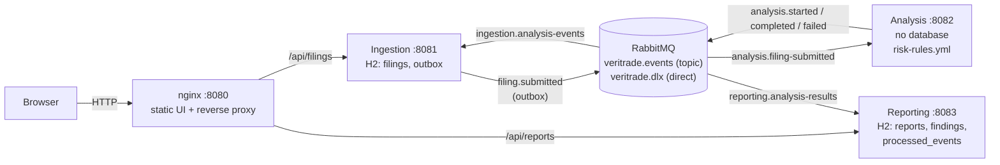
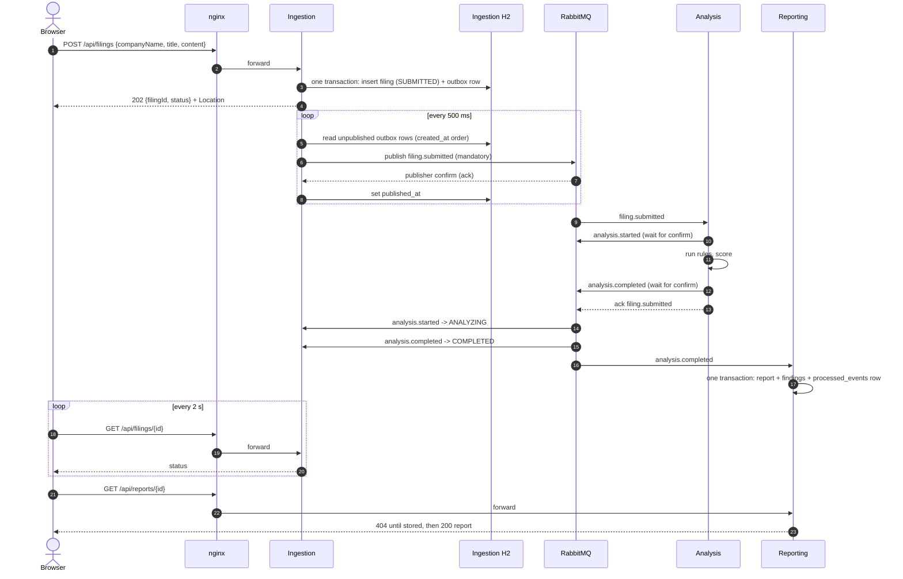
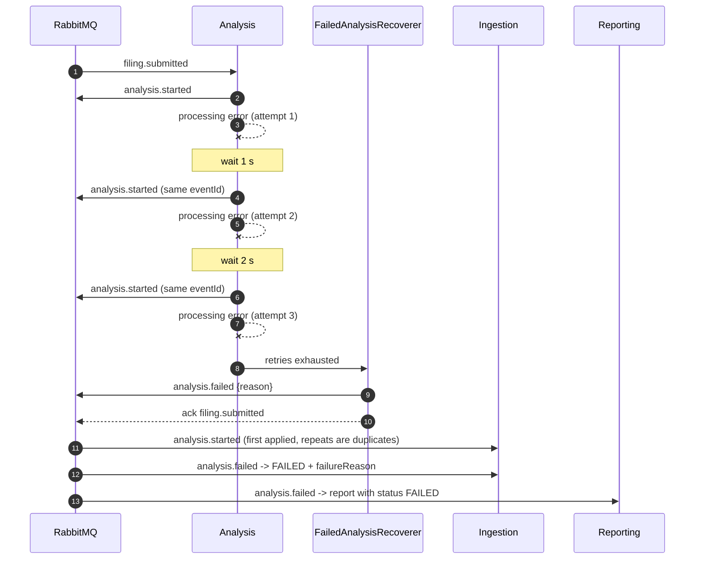
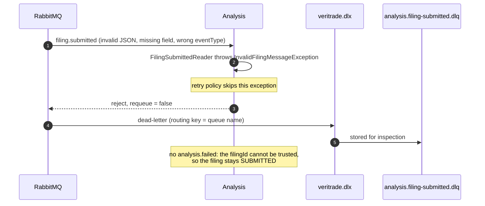
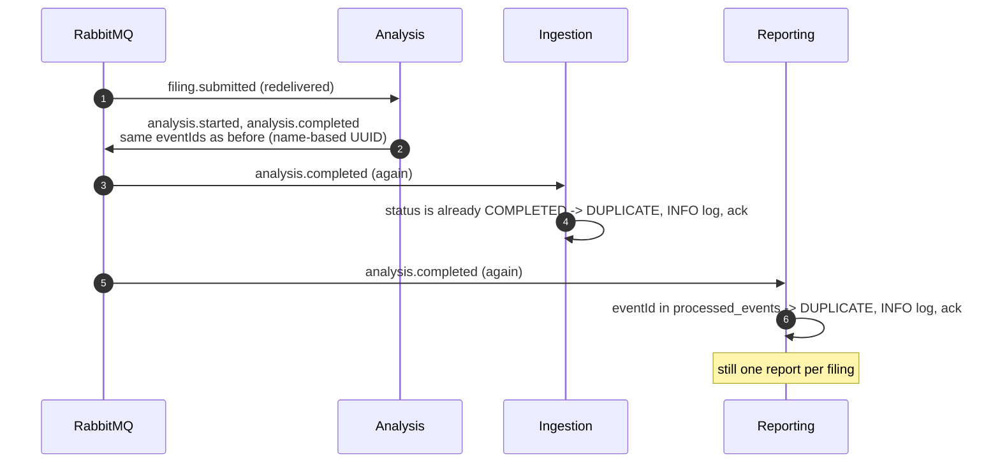
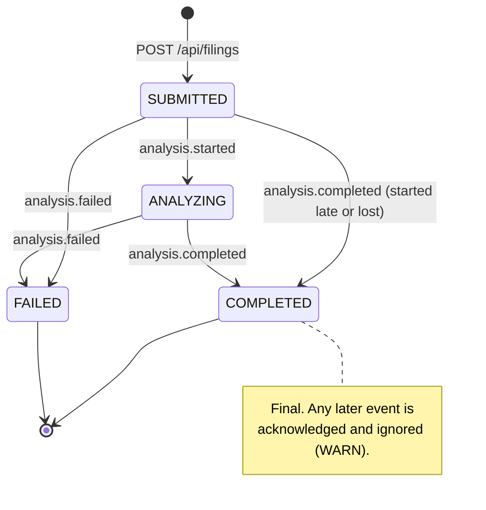
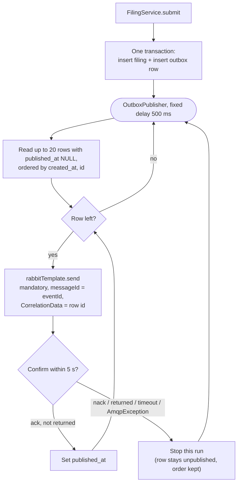
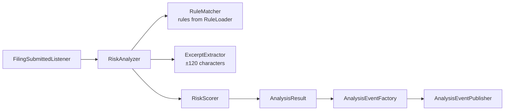

# Architecture

This document describes how VeriTrade Risk Analysis works as it is implemented. The exact contract
is in [`contracts/`](contracts/); the reasons for each choice are in the ADRs in
[`decisions/`](decisions/).

## 1. Components

| Component | Port | Published to the host | State |
|---|---|---|---|
| Frontend (nginx) | 8080 | yes | none |
| Ingestion | 8081 | no | H2 file `ingestion` (`filings`, `outbox`) |
| Analysis | 8082 (health only) | no | none |
| Reporting | 8083 | no | H2 file `reporting` (`reports`, `findings`, `processed_events`) |
| RabbitMQ | 5672 (AMQP), 15672 (management) | management only | durable queues |

<!-- verify after infra merge -->
The ports and the nginx routes follow PLAN.md section 3.1.1 and task E3. The frontend container and
the nginx configuration are added by the infrastructure work.

Responsibilities:

- **Ingestion** validates and stores filings, owns the filing status and publishes
  `filing.submitted` through a transactional outbox. It consumes all `analysis.*` events to move the
  status.
- **Analysis** consumes `filing.submitted`, runs the YAML rules over the text and publishes
  `analysis.started`, then `analysis.completed` or `analysis.failed`. It stores nothing.
- **Reporting** consumes `analysis.completed` and `analysis.failed`, stores one report per filing and
  serves it over REST.
- **Frontend** is plain HTML and JavaScript. It submits a filing, polls its status, then polls the
  report.

Inside each Java service the layers are `api -> service -> repository`, plus `messaging`, `domain`
and `config`. `domain` has no Spring imports. An ArchUnit test in each service checks this. In
Analysis the rule engine (`engine/`) is pure Java as well.

## 2. Events

Every event uses the same envelope: `eventId`, `eventType`, `eventVersion` (1), `occurredAt`,
`correlationId` and `payload`. The schemas are in [`contracts/`](contracts/).

| Routing key | `eventType` | Producer | Payload |
|---|---|---|---|
| `filing.submitted` | `FILING_SUBMITTED` | Ingestion (outbox) | filingId, companyName, title, content, submittedAt |
| `analysis.started` | `ANALYSIS_STARTED` | Analysis | filingId, startedAt |
| `analysis.completed` | `ANALYSIS_COMPLETED` | Analysis | filingId, analyzedAt, rulesVersion, summary, findings |
| `analysis.failed` | `ANALYSIS_FAILED` | Analysis | filingId, failedAt, reason |

AMQP properties on every message: `messageId` = `eventId`, `contentType` = `application/json`,
`correlationId` = the envelope `correlationId`, persistent delivery. Producers publish with
`mandatory = true` and wait for the publisher confirm.

## 3. Happy path

## 4. Processing failure path

A processing error (for example an exception in the analyzer, or a publish that is not confirmed) is
retried by the Spring AMQP listener retry: 3 attempts, 1 s initial interval, multiplier 2, at most
5 s. After the last attempt `FailedAnalysisRecoverer` publishes `analysis.failed` and the original
message is acknowledged.

If `analysis.failed` itself cannot be published, the recoverer rejects the message, so it goes to
`analysis.filing-submitted.dlq` instead of being lost.

Ingestion and Reporting use the same retry settings. After the last attempt their recoverer
(`RejectAndDontRequeueRecoverer`) sends the message to the queue's `.dlq`.

## 5. Poison message path

A message that cannot be read or validated fails the same way on every attempt, so it is not retried.

The same applies in the other consumers:

- **Ingestion** dead-letters an unreadable event, an unknown `eventType`, a missing `filingId` or
  `reason`, and an event for an unknown filing.
- **Reporting** dead-letters an unreadable event, an unknown or misrouted `eventType`, missing fields,
  values outside the schema limits, an unknown enum value and an `eventVersion` above 1.

Nothing consumes the dead-letter queues. They are inspected in the RabbitMQ management UI.

## 6. Duplicate delivery

Delivery is at-least-once: a consumer can get the same message twice, for example after a lost
acknowledgement, a listener retry or an outbox row that is sent again after a lost confirm.

A late or contradictory event, for example `analysis.started` after `analysis.completed`, or
`analysis.failed` after `analysis.completed`, is acknowledged and ignored with a WARN line that
contains the event id, the filing id and both states. The first terminal event wins
([ADR 0008](decisions/0008-first-terminal-event-wins.md)).

How each consumer detects repeats:

| Consumer | Mechanism |
|---|---|
| Analysis | none needed: it has no state, and its event ids are deterministic (`EventIds.forFiling`) |
| Ingestion | the status state machine: an event that asks for the current status is a duplicate |
| Reporting | `processed_events` table (written in the same transaction as the report), plus one report per `filingId` |

## 7. Filing status

Ingestion owns the status. `Filing.changeStatus` returns `APPLIED`, `DUPLICATE` or `REJECTED`. It
never throws for a valid filing.

## 8. Outbox with publisher confirms

- The filing and its event are committed together, so a stored filing is always announced.
- A row is marked published only after a positive confirm without a return. A return means that no
  queue is bound yet. That happens when Analysis has not declared its queue; the row is sent again
  later.
- The publisher stops at the first failure, so later rows never overtake an earlier one.
- After a restart, the unpublished rows are still in the H2 file and are sent on the first run.
- A lost confirm sends the row again with the same `messageId`; consumers drop the repeat.
- Only one instance may run the publisher (`ingestion.outbox.enabled=false` turns it off).

See [ADR 0004](decisions/0004-outbox-with-publisher-confirms.md).

## 9. Messaging topology

Exchanges:

| Name | Type | Durable |
|---|---|---|
| `veritrade.events` | topic | yes |
| `veritrade.dlx` | direct | yes |

Queues and bindings:

| Queue | Owner | Bound to | Binding keys | Dead-letter queue |
|---|---|---|---|---|
| `analysis.filing-submitted` | Analysis | `veritrade.events` | `filing.submitted` | `analysis.filing-submitted.dlq` |
| `ingestion.analysis-events` | Ingestion | `veritrade.events` | `analysis.*` | `ingestion.analysis-events.dlq` |
| `reporting.analysis-results` | Reporting | `veritrade.events` | `analysis.completed`, `analysis.failed` | `reporting.analysis-results.dlq` |
| `analysis.filing-submitted.dlq` | Analysis | `veritrade.dlx` | `analysis.filing-submitted` | - |
| `ingestion.analysis-events.dlq` | Ingestion | `veritrade.dlx` | `ingestion.analysis-events` | - |
| `reporting.analysis-results.dlq` | Reporting | `veritrade.dlx` | `reporting.analysis-results` | - |

- Work queues are durable classic queues with exactly two arguments: `x-dead-letter-exchange =
  veritrade.dlx` and `x-dead-letter-routing-key = <queue name>`. There is no TTL and no length limit,
  so a message waits as long as its consumer is down.
- Dead-letter queues are durable and have no arguments.
- Each service declares in its own `RabbitConfig` both exchanges, its work queue, its dead-letter
  queue and the bindings, with exactly these arguments. Declarations are idempotent, so the services
  can start in any order.
- Consumers: `AUTO` acknowledge mode (ack when the listener returns), prefetch 10, listener retry
  `max-retries: 2` (3 attempts in total), backoff 1 s, multiplier 2, at most 5 s.

The full definition is in [`contracts/messaging-topology.md`](contracts/messaging-topology.md).

## 10. Analysis engine

- `RuleLoader` reads `risk-rules.yml` at startup and validates it. The service does not start when
  the file is invalid.
- `RuleMatcher` matches case-insensitively. Overlapping matches of one rule are merged (the earlier
  match wins, and the longer one wins at the same start). Each rule keeps at most 50 matches
  (`max-matches-per-rule`). A matched text is cut to 500 characters.
- `position` is the zero-based UTF-16 offset of the match. Findings are sorted by position, then by
  rule id.
- `RiskScorer` computes the overall risk level:
  - `NONE` when there are no findings;
  - otherwise the highest severity found;
  - raised by one level when the number of findings is at least `escalation-threshold` (default
    10). `CRITICAL` stays `CRITICAL`.

All limits are set in `veritrade.analysis.rules.*` (`RulesProperties`).

## 11. Observability

- `GET /actuator/health` on every service, used by the container health checks.
- Ingestion takes the `X-Correlation-Id` request header, or generates an id, and returns it in the
  response. The id travels in the envelope and in the AMQP `correlationId`, and every log line shows
  it (`[%X{correlationId}]`).
