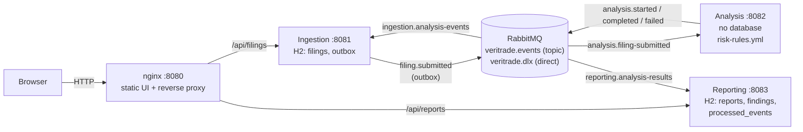
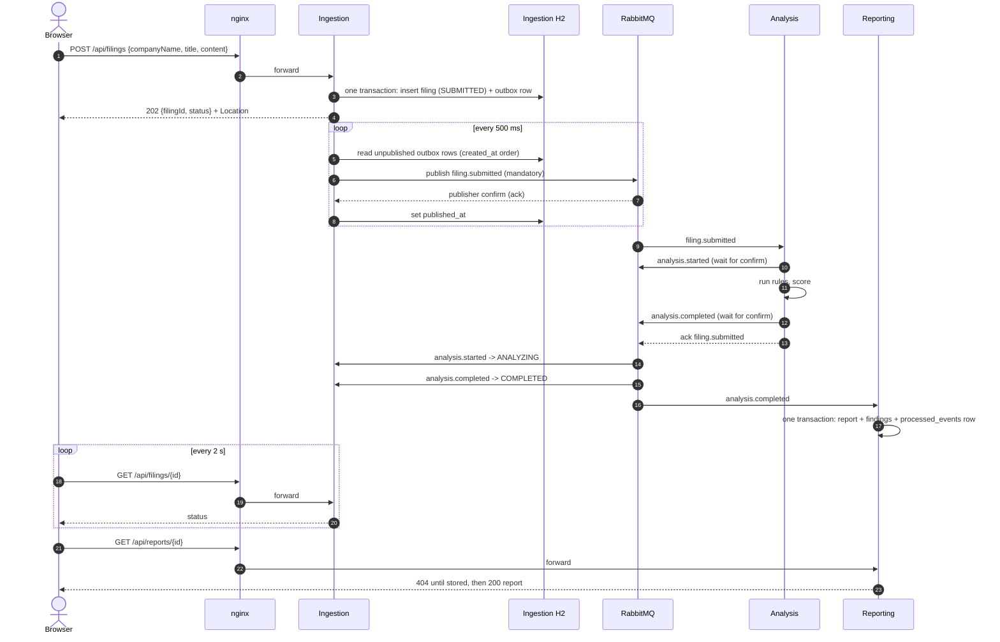
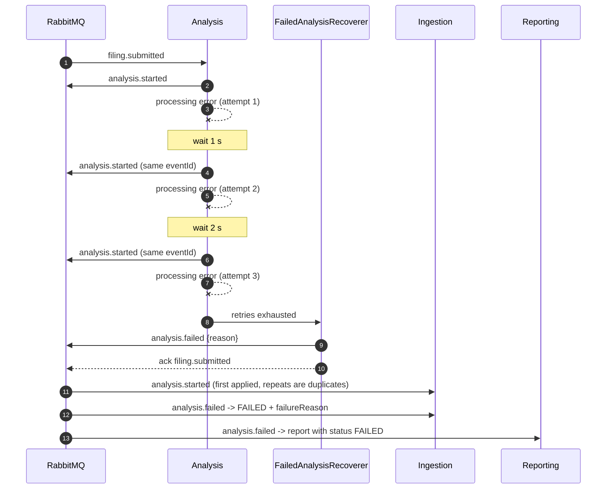
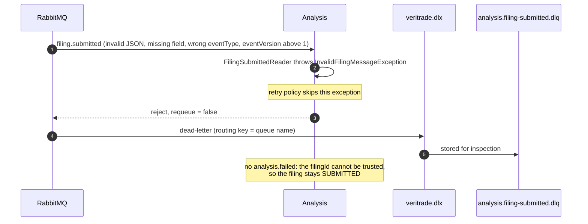
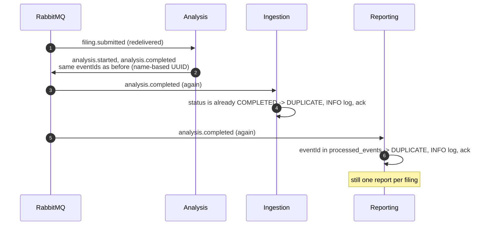
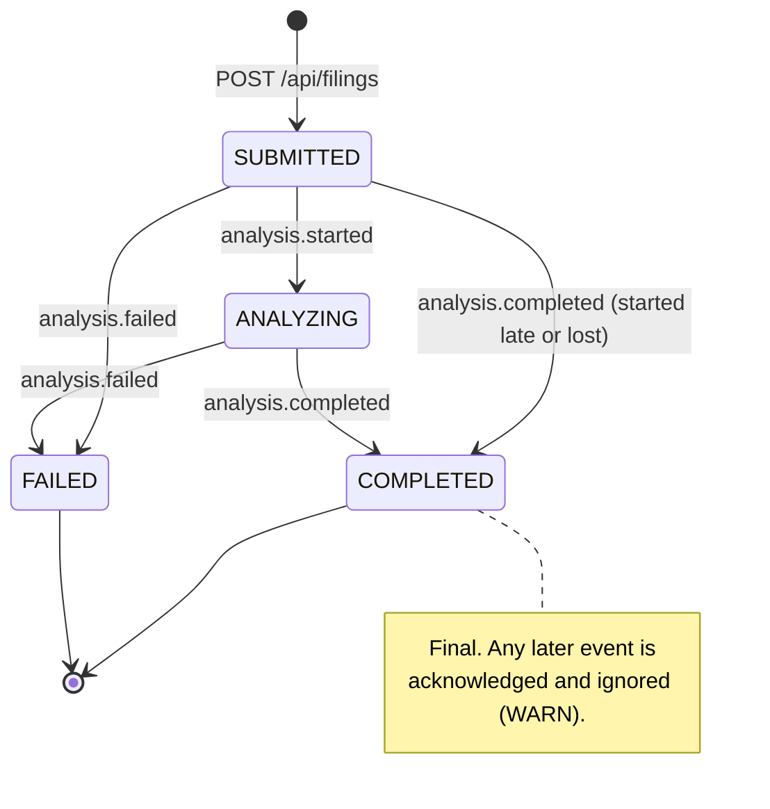
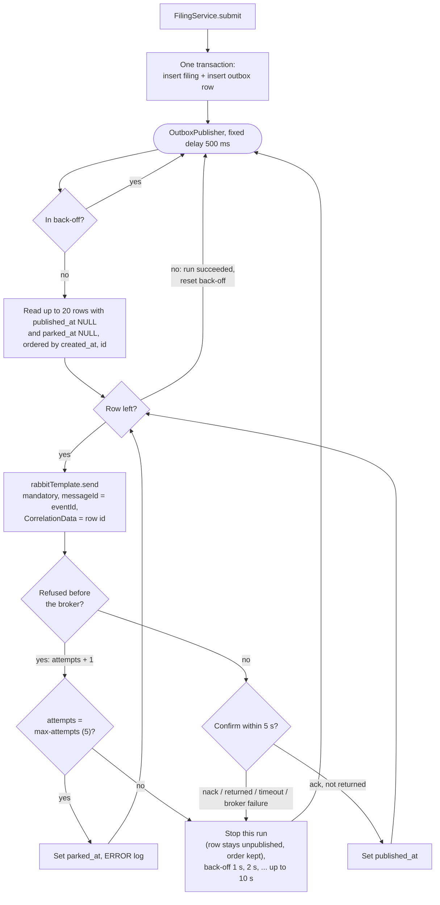
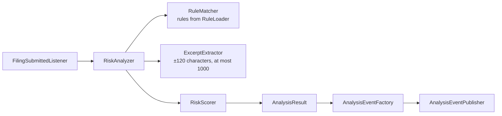

# Architecture

This document describes how VeriTrade Risk Analysis works as it is implemented. The exact contract
is in [`contracts/`](contracts/); the reasons for each choice are in the ADRs in
[`decisions/`](decisions/).

## 1. Components

| Component | Port | Published to the host | State |
|---|---|---|---|
| Frontend (nginx) | 8080 | yes, on `BIND_ADDRESS` | none |
| Ingestion | 8081 | no | H2 file `ingestion` (`filings`, `outbox`) |
| Analysis | 8082 (health only) | no | none |
| Reporting | 8083 | no | H2 file `reporting` (`reports`, `findings`, `processed_events`) |
| RabbitMQ | 5672 (AMQP), 15672 (management) | management only, on `BIND_ADDRESS` | durable queues (volume `rabbitmq-data`) |

The H2 files live in the volumes `ingestion-data` and `reporting-data`. The two published host ports
can be changed with `UI_PORT` and `RABBITMQ_MANAGEMENT_PORT` in `.env` (see
[`.env.example`](../.env.example)). Both are bound to `BIND_ADDRESS`, default `127.0.0.1`, so they are
reachable only from the host itself ([ADR 0013](decisions/0013-loopback-ports-and-broker-password-guard.md)).
All containers share one Compose network, `backend`. How the containers are built and what nginx does
is in [section 12](#12-containers-and-nginx).

Responsibilities:

- **Ingestion** validates and stores filings, owns the filing status and publishes
  `filing.submitted` through a transactional outbox. It consumes all `analysis.*` events to move the
  status.
- **Analysis** consumes `filing.submitted`, runs the YAML rules over the text and publishes
  `analysis.started`, then `analysis.completed` or `analysis.failed`. It stores nothing.
- **Reporting** consumes `analysis.completed` and `analysis.failed`, stores one report per filing and
  serves it over REST.
- **Frontend** is plain HTML and JavaScript. It submits a filing, polls its status, then polls the
  report.

Inside each Java service the layers are `api -> service -> repository`, plus `messaging`, `domain`
and `config`. `domain` has no Spring imports. An ArchUnit test in each service checks this. In
Analysis the rule engine (`engine/`) is pure Java as well.

## 2. Events

Every event uses the same envelope: `eventId`, `eventType`, `eventVersion` (1), `occurredAt`,
`correlationId` and `payload`. The schemas are in [`contracts/`](contracts/). Every consumer
dead-letters an `eventVersion` above 1 and a text over its limit in UTF-16 units, without retries; the
rules are in [`messaging-topology.md`](contracts/messaging-topology.md), sections "Event versioning"
and "Text limits" ([ADR 0014](decisions/0014-dead-letter-unsupported-event-versions.md)).

| Routing key | `eventType` | Producer | Payload |
|---|---|---|---|
| `filing.submitted` | `FILING_SUBMITTED` | Ingestion (outbox) | filingId, companyName, title, content, submittedAt |
| `analysis.started` | `ANALYSIS_STARTED` | Analysis | filingId, startedAt |
| `analysis.completed` | `ANALYSIS_COMPLETED` | Analysis | filingId, analyzedAt, rulesVersion, summary, findings |
| `analysis.failed` | `ANALYSIS_FAILED` | Analysis | filingId, failedAt, reason |

AMQP properties on every message: `messageId` = `eventId`, `contentType` = `application/json`,
`correlationId` = the envelope `correlationId`, persistent delivery. Producers publish with
`mandatory = true` and wait for the publisher confirm.

Consumers dispatch on the envelope's `eventType`, never on Spring's `__TypeId__` header, which
`JacksonJsonMessageConverter` adds. No listener container has a JSON converter, so every listener
reads the raw message. Analysis puts its JSON converter only on the `RabbitTemplate`; Ingestion (whose
outbox sends prebuilt messages) and Reporting declare no converter at all. Earlier, the converter was a
bean, the listener container converted
by `__TypeId__`, and valid events were dead-lettered or failed. Only runs against the real stack
found this (see the [README](../README.md#the-__typeid__-header)).

## 3. Happy path

The UI polls every 2 s, at most 30 times for the status and 15 times for the report. A 502, 503 or
504 (nginx answers 503 for a stopped service) or a network error does not end the flow: the UI
retries, and gives up only after more than 3 such errors in a row.

## 4. Processing failure path

A processing error (for example an exception in the analyzer, or a publish that is not confirmed) is
retried by the Spring AMQP listener retry: 3 attempts, 1 s initial interval, multiplier 2, at most
5 s. After the last attempt `FailedAnalysisRecoverer` publishes `analysis.failed` and the original
message is acknowledged. The reason is cut to 1000 UTF-16 units
(`veritrade.analysis.messaging.max-reason-length`) without splitting a surrogate pair.

If `analysis.failed` itself cannot be published, the recoverer rejects the message, so it goes to
`analysis.filing-submitted.dlq` instead of being lost.

Ingestion and Reporting use the same retry settings. After the last attempt their recoverer
(`RejectAndDontRequeueRecoverer`) sends the message to the queue's `.dlq`.

## 5. Poison message path

A message that cannot be read or validated fails the same way on every attempt, so it is not retried.

The same applies in the other consumers:

- **Ingestion** dead-letters an unreadable event, an unknown `eventType`, an `eventVersion` above 1, a
  missing `filingId` or `reason`, a `reason` over 1000 UTF-16 units, and an event for an unknown
  filing.
- **Reporting** dead-letters an unreadable event, an unknown or misrouted `eventType`, missing fields,
  values outside the schema limits, an unknown enum value and an `eventVersion` above 1.

Nothing consumes the dead-letter queues. They are inspected in the RabbitMQ management UI.

## 6. Duplicate delivery

Delivery is at-least-once: a consumer can get the same message twice, for example after a lost
acknowledgement, a listener retry or an outbox row that is sent again after a lost confirm.

A late or contradictory event, for example `analysis.started` after `analysis.completed`, or
`analysis.failed` after `analysis.completed`, is acknowledged and ignored with a WARN line that
contains the event id, the filing id and both states. The first terminal event wins
([ADR 0008](decisions/0008-first-terminal-event-wins.md)).

How each consumer detects repeats:

| Consumer | Mechanism |
|---|---|
| Analysis | none needed: it has no state, and its event ids are deterministic (`EventIds.forFiling`) |
| Ingestion | the status state machine: an event that asks for the current status is a duplicate |
| Reporting | `processed_events` table (written in the same transaction as the report), plus one report per `filingId` |

## 7. Filing status

Ingestion owns the status. `FilingStatus.transitionTo` returns `APPLIED`, `DUPLICATE` or `REJECTED`.
It never throws for a valid filing. `FilingStatusService` reads only the id, status and version of the
filing (`FilingState`) and writes an applied change with a JPQL update that checks and increments
`version`, so a status event never loads the up to 2 MB content. A concurrent change gives an
`OptimisticLockingFailureException`, and the listener retry reads the filing again.

## 8. Outbox with publisher confirms

- The filing and its event are committed together, so a stored filing is always announced.
- A row is marked published only after a positive confirm without a return. A return means that no
  queue is bound yet. That happens when Analysis has not declared its queue; the row is sent again
  later.
- The publisher stops at the first failure, so later rows never overtake an earlier one.
- Only a failure of the row itself counts against it: the AMQP client refuses the message before it
  reaches the broker (an `IllegalArgumentException` in the cause chain or a
  `MessageConversionException`, see `PublishFailures`). After `ingestion.outbox.max-attempts`
  (default 5) such failures the row is parked and the run goes on with the next rows. Connection, I/O,
  timeout, authentication and channel-limit failures, nacks, returns and missing confirms never count,
  so a broker outage parks nothing ([ADR 0011](decisions/0011-park-poison-outbox-rows.md)).
- After a run that stops early, the next runs are skipped for an exponential back-off
  (`ingestion.outbox.retry-backoff` 1 s, `retry-backoff-multiplier` 2, `max-retry-backoff` 10 s). The
  next successful run resets it.
- `attempts`, `last_error` and `parked_at` come from the migration `V2__outbox_attempts.sql`. A parked
  row leaves its filing `SUBMITTED`; there is no replay tool.
- After a restart, the unpublished rows are still in the H2 file and are sent on the first run.
- A lost confirm sends the row again with the same `messageId`; consumers drop the repeat.
- Only one instance may run the publisher (`ingestion.outbox.enabled=false` turns it off).

See [ADR 0004](decisions/0004-outbox-with-publisher-confirms.md).

## 9. Messaging topology

Exchanges:

| Name | Type | Durable |
|---|---|---|
| `veritrade.events` | topic | yes |
| `veritrade.dlx` | direct | yes |

Queues and bindings:

| Queue | Owner | Bound to | Binding keys | Dead-letter queue |
|---|---|---|---|---|
| `analysis.filing-submitted` | Analysis | `veritrade.events` | `filing.submitted` | `analysis.filing-submitted.dlq` |
| `ingestion.analysis-events` | Ingestion | `veritrade.events` | `analysis.*` | `ingestion.analysis-events.dlq` |
| `reporting.analysis-results` | Reporting | `veritrade.events` | `analysis.completed`, `analysis.failed` | `reporting.analysis-results.dlq` |
| `analysis.filing-submitted.dlq` | Analysis | `veritrade.dlx` | `analysis.filing-submitted` | - |
| `ingestion.analysis-events.dlq` | Ingestion | `veritrade.dlx` | `ingestion.analysis-events` | - |
| `reporting.analysis-results.dlq` | Reporting | `veritrade.dlx` | `reporting.analysis-results` | - |

- Work queues are durable classic queues with exactly two arguments: `x-dead-letter-exchange =
  veritrade.dlx` and `x-dead-letter-routing-key = <queue name>`. There is no TTL and no length limit,
  so a message waits as long as its consumer is down.
- Dead-letter queues are durable and have no arguments.
- Each service declares in its own `RabbitConfig` both exchanges, its work queue, its dead-letter
  queue and the bindings, with exactly these arguments. Declarations are idempotent, so the services
  can start in any order.
- Consumers: `AUTO` acknowledge mode (ack when the listener returns), prefetch 10, listener retry
  `max-retries: 2` (3 attempts in total), backoff 1 s, multiplier 2, at most 5 s.

The full definition is in [`contracts/messaging-topology.md`](contracts/messaging-topology.md).

## 10. Analysis engine

- `RuleLoader` reads `risk-rules.yml` at startup and validates it. The service does not start when
  the file is invalid.
- Whitespace-tolerant patterns (`rulesVersion` 1.1): before compiling, `RuleLoader` passes every
  pattern through `WhitespaceTolerance`, which turns each run of literal spaces outside a character
  class into `[\h\v]+` (one or more horizontal or vertical whitespace characters, including U+00A0)
  and a quantified space into an optional run. A space inside `[...]` or `\Q...\E` is rejected. The
  text is never normalised, so positions and excerpts refer to the original content.
- `RuleMatcher` matches case-insensitively. Overlapping matches of one rule are merged (the earlier
  match wins, and the longer one wins at the same start). Each rule keeps at most 50 matches
  (`max-matches-per-rule`). A matched text is cut to 500 UTF-16 units (`max-matched-text-chars`, at
  most 500).
- `ExcerptExtractor` takes up to 120 characters of context on each side (`excerpt-context-chars`),
  never splits a surrogate pair, and keeps the whole excerpt within `max-excerpt-chars` (default 1000,
  between `max-matched-text-chars` and 1000): for a long match the context shrinks.
- `position` is the zero-based UTF-16 offset of the match. Findings are sorted by position, then by
  rule id.
- `RiskScorer` computes the overall risk level:
  - `NONE` when there are no findings;
  - otherwise the highest severity found;
  - raised by one level when the number of findings is at least `escalation-threshold` (default
    10). `CRITICAL` stays `CRITICAL`.

All limits are set in `veritrade.analysis.rules.*` (`RulesProperties`).

## 11. Observability

- `GET /actuator/health` on every service, used by the container health checks. nginx has its own
  `/healthz`.
- Ingestion takes the `X-Correlation-Id` request header when it is a strict ASCII token (1 to 128
  characters from `[A-Za-z0-9._:-]`, after surrounding whitespace is stripped). Otherwise, and when the
  header is missing, it generates a UUID; it never rejects the request for it
  ([ADR 0012](decisions/0012-replace-invalid-correlation-ids.md)). It returns the id in the response.
  The id travels in the envelope and in the AMQP `correlationId`, and every log line shows it
  (`[%X{correlationId}]`).
- nginx writes the `X-Correlation-Id` request header into its access log (`cid="..."`), next to the
  upstream address and the request time.

## 12. Containers and nginx

The stack is defined in [`docker-compose.yml`](../docker-compose.yml): RabbitMQ, the three services
and nginx. Every container has a health check, and `depends_on: condition: service_healthy` orders the
start: the Java services wait for RabbitMQ, and nginx waits for Ingestion and Reporting. Services
restart `unless-stopped`.

### RabbitMQ image

[`infra/docker/rabbitmq.Dockerfile`](../infra/docker/rabbitmq.Dockerfile) builds on
`rabbitmq:4.3-management-alpine` and puts
[`infra/rabbitmq/credentials-guard.sh`](../infra/rabbitmq/credentials-guard.sh) in front of the
official entrypoint. Compose passes `BIND_ADDRESS` to it as `VERITRADE_BIND_ADDRESS`. A known weak
password (`veritrade`, `change-me`, `guest`, empty) is accepted only on a loopback address (`127.*`,
`::1`, `localhost`) and logs a `WARNING`; on any other address the container exits with an `ERROR`.
`credentials-guard.sh check` runs only the check; `scripts/smoke.sh` uses it
([ADR 0013](decisions/0013-loopback-ports-and-broker-password-guard.md)).

### One Dockerfile for the Java services

[`infra/docker/java-service.Dockerfile`](../infra/docker/java-service.Dockerfile) builds any of the
three services. Compose passes the build arguments `SERVICE` (the Maven module) and `PORT`. The three
builds differ only in these two values, so three copies of the file would only drift apart. The
build:

- is multi-stage, with the repository root as the context;
- runs `./mvnw -B -q -pl <service> -am package -DskipTests` with a BuildKit cache mount on
  `/root/.m2`. Only `src/main` of the service and of `common-contracts` is copied, so no test code is
  compiled in the image; the tests run in CI;
- extracts the Spring Boot layered jar onto `eclipse-temurin:21-jre-alpine`;
- runs as the non-root user `app` (uid 10001), which owns `/app/data`;
- sets `-XX:MaxRAMPercentage=75 -XX:+ExitOnOutOfMemoryError`;
- has a health check on `http://localhost:$PORT/actuator/health`.

### nginx

[`infra/docker/frontend.Dockerfile`](../infra/docker/frontend.Dockerfile) builds on
`nginxinc/nginx-unprivileged:1.29-alpine`, which runs as non-root on port 8080. The configuration is
[`infra/nginx/default.conf`](../infra/nginx/default.conf).

- **Only the UI files are served.** The image holds `index.html`, `styles.css` and `js/`. A
  Dockerfile-specific ignore file keeps `mock/`, `test/`, `package.json` and `README.md` out of the
  build context, so they are 404. `.js` is served with a JavaScript MIME type, which
  `<script type="module">` requires.
- **Two API routes.** `/api/filings` goes to `ingestion-service:8081` and `/api/reports` to
  `reporting-service:8083`, with the full URI (`/api` is not stripped). Any other `/api/` path is a
  404 `application/problem+json`.
- **Upstreams are resolved per request.** `proxy_pass` uses variables and the resolver is Docker's
  DNS (`127.0.0.11`, `valid=5s`, `resolver_timeout 2s`). nginx therefore starts even when a service is
  down, and it follows a restarted container to its new address within 5 s.
- **Fast 503 for a stopped service.** A stopped container's name stops resolving at once, which gives
  503 in milliseconds. While nginx still holds the cached address (at most 5 s), a connect to it never
  answers, so `proxy_connect_timeout 2s` cuts it short: the client gets the 503 within about 2 s
  instead of after about 15 s. `proxy_send_timeout` and `proxy_read_timeout` are 30 s.
- **Errors are problem+json.** An upstream 502, 503 or 504 (a stopped or unreachable service) becomes
  `503 application/problem+json`. A body over 3 MB becomes `413 application/problem+json`.
- **Body size.** `client_max_body_size 3m`: a filing of 2 MB plus JSON escaping fits, and a content of
  2 MB + 1 byte reaches Ingestion, which answers 400. The nginx default of 1 MB would answer 413 first.
- **Headers.** `X-Correlation-Id` is passed to the service and comes back in the response.
  [`infra/nginx/security-headers.conf`](../infra/nginx/security-headers.conf) is included at server
  level and in `location /`, so every response, including nginx's own problem responses, carries
  `Content-Security-Policy: default-src 'self'; object-src 'none'; base-uri 'none'; form-action 'self';
  frame-ancestors 'none'`, `X-Content-Type-Options: nosniff` and `Referrer-Policy: no-referrer`. The
  UI files are also sent with `Cache-Control: no-cache`. The UI has no inline script, style or event
  handler, so the policy needs no `'unsafe-inline'`.
